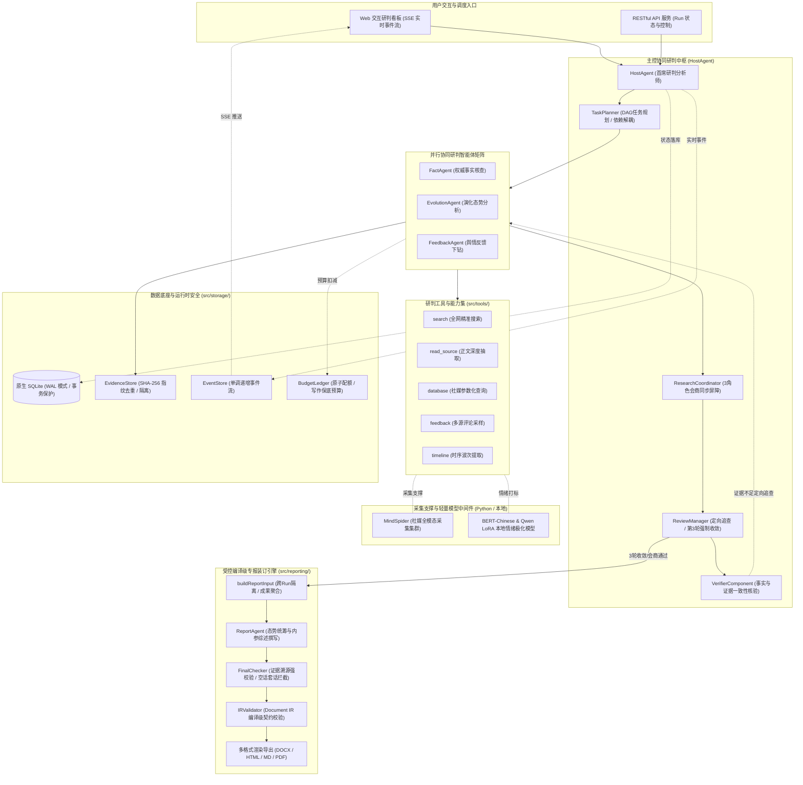

<div align="center">

# 🌊 观澜 · GuanLan
### 全媒体多智能体态势研判与决策专报平台
#### Multi-Agent Situation Awareness & Decision Reporting Platform

*“观水有术，必观其澜” —— 面向重大突发事件全网多源态势感知、多智能体会商博弈与受控专报装订的自主 Multi-Agent 系统*

[](https://nodejs.org/)
[](https://www.typescriptlang.org/)
[](https://python.org/)
[](./agent-runtime/)
[](./tests/)
[](LICENSE)

[English](./README-EN.md) | [中文文档](./README.md)

</div>

## ⚡ 项目概述

**「观澜」** 面向重大突发事件全网多源态势感知与研判决策场景，构建集**多源跨模态采集**、**多智能体会商博弈**与**受控专报装订**于一体的 Multi-Agent 舆情推演与内参生成平台。

系统打破了传统单一模型研判中的“信息茧房”与认知从众（Sycophancy）偏见，用户只需输入研判议题，系统即可驱动多智能体矩阵全自动完成权威叙事追踪、社媒跨模态感知、私有数据挖掘、异步会商博弈与受控编译级专报装订。

### 🚀 核心技术亮点

1. **现代 TypeScript 协同研判引擎 (`agent-runtime/`)**：
   - 核心研判系统深度解耦，承载会商编排、状态机、严格证据溯源、IR 编译与决策专报装订，提供低延迟、强类型与高可靠的研判中枢。
   - **原生极速底座**：基于 Node.js 22 原生 `node:sqlite`（WAL 模式）、Zod 强类型领域契约与 SHA-256 去重证据池。
   - **严格证据闭环与预算管理**：每条核心事实必须双向绑定证据指纹，未验证事实无法入库；原子配额扣减确保终稿写作预算底线。
   - **3 角色会商屏障与强制收敛**：事实核查、态势演化、舆情反馈 3 智能体并行调研；第 3 轮会商强制收敛，彻底杜绝无限死循环。
   - **全量自动化测试套件**：内建 91 项自动化测试，全面覆盖证据闭环、会商收敛、预算防护、崩溃恢复与专报导出 5 大核心场景。

2. **全媒体跨模态 Agent 矩阵架构**：
   - 权威叙事追踪、社媒跨模态感知与私有库情绪挖掘三层解耦的 Agent 矩阵。
   - 覆盖微博、小红书、抖音、快手等主流社媒图文、短视频及结构化卡片，实现全域态势的网格化感知。

3. **主控驱动的会商博弈与定向追查机制**：
   - 告别传统松散漫谈模式，采用首席分析师 Host 模型统筹与同步屏障机制。
   - 评审发现证据不足时，仅对特定智能体下发定向追查任务，其余角色成果自动 Carry-Forward，大幅降低幻觉与无效开销。

4. **端云分级协同与轻量微调降本**：
   - 构建“本地轻量模型打标 + 云端大模型高层研判”架构；基于 LoRA 微调本地 BERT-Chinese 与小参数 Qwen 模型，完成多维度情绪极化分类，测试集 F1-score 达 91.8%，API 调用成本降低 74%。

5. **受控编译级 Document IR 装订引擎**：
   - 解决大模型长篇研报生成的结构坍塌与图表语法损坏问题，严格遵循 JSON Schema 的 Document IR 规范；实现篇幅预算拆解、章节流水线生成、Echarts 图表语法自愈校验与最终纯 JS 装订导出（DOCX / Markdown / HTML / PDF），报告全流程自动化出稿合格率达 95.2%。

## 🏗️ 系统架构

### 实时研判协同架构图



### 一次完整研判决策流程

| 阶段 | 核心动作 | 参与组件 | 核心机制与输出约束 |
|---|---|---|---|
| **1. 议题接收与 DAG 规划** | 接收用户研判议题，拆解研判意图并生成任务 DAG | HostAgent + TaskPlanner | 有向无环图依赖校验，初始角色预算分配，建立 Run 隔离域 |
| **2. 三角色并行深入调研** | 3 智能体按职责并发调用工具链，提取核心事实 | Fact / Evolution / Feedback | 最大 3 并发调度；事实强绑定证据录入 EvidenceStore；原子预扣预算 |
| **3. 会商屏障与事实核验** | 等待三方成果齐备，触发同步屏障与事实核验 | Coordinator + VerifierComponent | 严格核验 Claim 关联证据；支持官方事实与大众情绪多维共存评估 |
| **4. Host 评审与定向追查** | Host 综合各方研判结果，决定通过或定向追加调研 | HostAgent + ReviewManager | **定向分派**：仅对信息缺口角色下发补充指令，其余角色 Carry-Forward；**第 3 轮强制收敛** |
| **5. 受控编译与专报装订** | 聚合终审证据集，撰写长篇专报并装订多格式交付 | ReportAgent + IRValidator + Renderers | **FinalChecker 门禁**：拦截泛化空话套话与悬空事实；Document IR 语法校验；纯 JS 原生导出 DOCX/HTML/MD |


### 项目代码结构树

```
GuanLan/
├── agent-runtime/                          # 🚀 纯 TypeScript / Node.js 多智能体协同研判独立运行时
│   ├── src/contracts/                      # 统一领域契约 (Zod schema 运行时校验)
│   ├── src/storage/                        # 原生 SQLite 数据层、证据池、事件流与预算账本
│   ├── src/orchestration/                  # 任务规划、并发调度、成果提交、会商评审与恢复管理
│   ├── src/tools/                          # 本地研究工具集 (联网搜索、正文抓取、社媒参数化查询、时间序列)
│   ├── src/agents/                         # Pi Agent 核心 (HostAgent, ResearcherAgent, ReportAgent, Verifier)
│   ├── src/reporting/                      # 专报研判综合、终稿质量门禁、IR 校验与多格式导出 (MD/HTML/DOCX/PDF)
│   ├── src/api/                            # RESTful HTTP API、SSE 实时流与 Web 仪表盘
│   └── tests/                              # 91 项自动化单元测试与端到端核心基准案例
│
├── QueryEngine/                            # 国内外新闻广度搜索Agent
│   ├── agent.py                            # Agent主逻辑，协调搜索与分析流程
│   ├── llms/                               # LLM接口封装
│   ├── nodes/                              # 处理节点：搜索、格式化、总结等
│   ├── tools/                              # 国内外新闻搜索工具集
│   ├── utils/                              # 工具函数
│   ├── state/                              # 状态管理
│   ├── prompts/                            # 提示词模板
│   └── ...
├── MediaEngine/                            # 强大的多模态理解Agent
│   ├── agent.py                            # Agent主逻辑，处理视频/图片等多模态内容
│   ├── llms/                               # LLM接口封装
│   ├── nodes/                              # 处理节点：搜索、格式化、总结等
│   ├── tools/                              # 多模态搜索工具集
│   ├── utils/                              # 工具函数
│   ├── state/                              # 状态管理
│   ├── prompts/                            # 提示词模板
│   └── ...
├── InsightEngine/                          # 私有数据库挖掘Agent
│   ├── agent.py                            # Agent主逻辑，协调数据库查询与分析
│   ├── llms/                               # LLM接口封装
│   │   └── base.py                         # 统一的OpenAI兼容客户端
│   ├── nodes/                              # 处理节点：搜索、格式化、总结等
│   │   ├── base_node.py                    # 基础节点类
│   │   ├── search_node.py                  # 搜索节点
│   │   ├── formatting_node.py              # 格式化节点
│   │   ├── report_structure_node.py        # 报告结构节点
│   │   └── summary_node.py                 # 总结节点
│   ├── tools/                              # 数据库查询和分析工具集
│   │   ├── keyword_optimizer.py            # Qwen关键词优化中间件
│   │   ├── search.py                       # 数据库操作工具集（话题搜索、评论获取等）
│   │   └── sentiment_analyzer.py           # 情感分析集成工具
│   ├── utils/                              # 工具函数
│   │   ├── config.py                       # 配置管理
│   │   ├── db.py                           # SQLAlchemy异步引擎与只读查询封装
│   │   └── text_processing.py              # 文本处理工具
│   ├── state/                              # 状态管理
│   │   └── state.py                        # Agent状态定义
│   ├── prompts/                            # 提示词模板
│   │   └── prompts.py                      # 各类提示词
│   └── __init__.py
├── ReportEngine/                           # 多轮报告生成Agent
│   ├── agent.py                            # 总调度器：模板选择→布局→篇幅→章节→渲染
│   ├── flask_interface.py                  # Flask/SSE入口，管理任务排队与流式事件
│   ├── llms/                               # OpenAI兼容LLM封装
│   │   └── base.py                         # 统一的流式/重试客户端
│   ├── core/                               # 核心功能：模板解析、章节存储、文档装订
│   │   ├── template_parser.py              # Markdown模板切片与slug生成
│   │   ├── chapter_storage.py              # 章节run目录、manifest与raw流写入
│   │   └── stitcher.py                     # Document IR装订器，补齐锚点/元数据
│   ├── ir/                                 # 报告中间表示（IR）契约与校验
│   │   ├── schema.py                       # 块/标记Schema常量定义
│   │   └── validator.py                    # 章节JSON结构校验器
│   ├── nodes/                              # 全流程推理节点
│   │   ├── base_node.py                    # 节点基类+日志/状态钩子
│   │   ├── template_selection_node.py      # 模板候选收集与LLM筛选
│   │   ├── document_layout_node.py         # 标题/目录/主题设计
│   │   ├── word_budget_node.py             # 篇幅规划与章节指令生成
│   │   └── chapter_generation_node.py      # 章节级JSON生成+校验
│   ├── prompts/                            # 提示词库与Schema说明
│   │   └── prompts.py                      # 模板选择/布局/篇幅/章节提示词
│   ├── renderers/                          # IR渲染器
│   │   ├── html_renderer.py                # Document IR→交互式HTML
│   │   ├── pdf_renderer.py                 # HTML→PDF导出（WeasyPrint）
│   │   ├── pdf_layout_optimizer.py         # PDF布局优化器
│   │   └── chart_to_svg.py                 # 图表转SVG工具
│   ├── state/                              # 任务/元数据状态模型
│   │   └── state.py                        # ReportState与序列化工具
│   ├── utils/                              # 配置与辅助工具
│   │   ├── config.py                       # Pydantic Settings与打印助手
│   │   ├── dependency_check.py             # 依赖检查工具
│   │   ├── json_parser.py                  # JSON解析工具
│   │   ├── chart_validator.py              # 图表校验工具
│   │   └── chart_repair_api.py             # 图表修复API
│   ├── report_template/                    # Markdown模板库
│   │   ├── 企业品牌声誉分析报告.md
│   │   └── ...
│   └── __init__.py
├── ForumEngine/                            # (历史参考) 早期漫谈式协作原型
│   ├── monitor.py                          # 早期日志监控
│   ├── llm_host.py                         # 早期主持人LLM模块
│   └── __init__.py
├── MindSpider/                             # 社交媒体爬虫系统
│   ├── main.py                             # 爬虫主程序入口
│   ├── config.py                           # 爬虫配置文件
│   ├── BroadTopicExtraction/               # 话题提取模块
│   │   ├── main.py                         # 话题提取主程序
│   │   ├── database_manager.py             # 数据库管理器
│   │   ├── get_today_news.py               # 今日新闻获取
│   │   └── topic_extractor.py              # 话题提取器
│   ├── DeepSentimentCrawling/              # 深度舆情爬取模块
│   │   ├── main.py                         # 深度爬取主程序
│   │   ├── keyword_manager.py              # 关键词管理器
│   │   ├── platform_crawler.py             # 平台爬虫管理
│   │   └── MediaCrawler/                   # 社媒爬虫核心
│   │       ├── main.py
│   │       ├── config/                     # 各平台配置
│   │       ├── media_platform/             # 各平台爬虫实现
│   │       └── ...
│   └── schema/                             # 数据库结构定义
│       ├── db_manager.py                   # 数据库管理器
│       ├── init_database.py                # 数据库初始化脚本
│       ├── mindspider_tables.sql           # 数据库表结构SQL
│       ├── models_bigdata.py               # 大规模媒体舆情表的SQLAlchemy映射
│       └── models_sa.py                    # DailyTopic/Task等扩展表ORM模型
├── SentimentAnalysisModel/                 # 情感分析模型集合
│   ├── WeiboSentiment_Finetuned/           # 微调BERT/GPT-2模型
│   │   ├── BertChinese-Lora/               # BERT中文LoRA微调
│   │   │   ├── train.py
│   │   │   ├── predict.py
│   │   │   └── ...
│   │   └── GPT2-Lora/                      # GPT-2 LoRA微调
│   │       ├── train.py
│   │       ├── predict.py
│   │       └── ...
│   ├── WeiboMultilingualSentiment/         # 多语言情感分析
│   │   ├── train.py
│   │   ├── predict.py
│   │   └── ...
│   ├── WeiboSentiment_SmallQwen/           # 小参数Qwen3微调
│   │   ├── train.py
│   │   ├── predict_universal.py
│   │   └── ...
│   └── WeiboSentiment_MachineLearning/     # 传统机器学习方法
│       ├── train.py
│       ├── predict.py
│       └── ...
├── SingleEngineApp/                        # 单独Agent的Streamlit应用
│   ├── query_engine_streamlit_app.py       # QueryEngine独立应用
│   ├── media_engine_streamlit_app.py       # MediaEngine独立应用
│   └── insight_engine_streamlit_app.py     # InsightEngine独立应用
├── query_engine_streamlit_reports/         # QueryEngine单应用运行输出
├── media_engine_streamlit_reports/         # MediaEngine单应用运行输出
├── insight_engine_streamlit_reports/       # InsightEngine单应用运行输出
├── templates/                              # Flask前端模板
│   └── index.html                          # 主界面HTML
├── static/                                 # 静态资源
│   ├── image/                              # 图片资源
│   │   └── ...
│   ├── Partial README for PDF Exporting/   # PDF导出依赖配置说明
│   └── v2_report_example/                  # 报告渲染示例
│       └── report_all_blocks_demo/         # 全块类型演示（HTML/PDF/MD）
├── logs/                                   # 运行日志目录
├── final_reports/                          # 最终生成的报告文件
│   ├── ir/                                 # 报告IR JSON文件
│   └── *.html                              # 最终HTML报告
├── utils/                                  # 通用工具函数
│   ├── forum_reader.py                     # (历史参考) 早期通信工具
│   ├── github_issues.py                    # 统一生成GitHub Issue链接与错误提示
│   └── retry_helper.py                     # 网络请求重试机制工具
├── tests/                                  # 单元测试与集成测试
│   ├── run_tests.py                        # pytest入口脚本
│   ├── test_monitor.py                     # 早期监控单元测试
│   ├── test_report_engine_sanitization.py  # ReportEngine安全性测试
│   └── ...
├── app.py                                  # Flask主应用入口
├── config.py                               # 全局配置文件
├── .env.example                            # 环境变量示例文件
├── docker-compose.yml                      # Docker多服务编排配置
├── Dockerfile                              # Docker镜像构建文件
├── requirements.txt                        # Python依赖包清单
├── regenerate_latest_html.py               # 使用最新章节重装订并渲染HTML
├── regenerate_latest_md.py                 # 使用最新章节重装订并渲染Markdown
├── regenerate_latest_pdf.py                # PDF重新生成工具脚本
├── report_engine_only.py                   # Report Engine命令行版本
├── README.md                               # 中文说明文档
├── README-EN.md                            # 英文说明文档
├── CONTRIBUTING.md                         # 中文贡献指南
├── CONTRIBUTING-EN.md                      # 英文贡献指南
└── LICENSE                                 # GPL-2.0开源许可证
```

## ⚡ 极速开始：纯 TypeScript / Node.js 独立运行时（推荐）

「观澜」已全面支持纯 TypeScript / Node.js 独立运行。无需配置 Python / Conda / PostgreSQL 环境，开箱即用体验多智能体协同研判与交互式 Web 看板：

```bash
# 1. 进入运行时目录
cd agent-runtime

# 2. 安装依赖并编译构建
npm install
npm run build

# 3. 执行全量 91 项自动化测试与基准用例
npm test

# 4. 启动研判服务与 Web 交互看板
npm start
# 浏览器访问：http://localhost:3000
```

- **RESTful API 研判任务创建**：`POST http://localhost:3000/api/research/runs`
- **SSE 实时会商事件流**：`GET http://localhost:3000/api/research/runs/:id/events`
- **纯 JS 决策专报多格式导出**：支持一键生成规范 `.docx`、交互式 `.html`、`.md` 与 `.pdf`
- 详细架构与接口规范请参阅：[Node.js 运行时开发者指南](./docs/guides/node-runtime.md)

---

## 🚀 完整系统部署（Docker 全组件）

### 1. 启动项目

复制一份 `.env.example` 文件，命名为 `.env` ，并按需配置 `.env` 文件中的环境变量

执行以下命令在后台启动所有服务：

```bash
docker compose up -d
```

> **注：镜像拉取速度慢**，在原 `docker-compose.yml` 文件中，我们已经通过**注释**的方式提供了备用镜像地址供您替换

### 2. 配置说明

#### 数据库配置（PostgreSQL）

请按照以下参数配置数据库连接信息，也支持Mysql可自行修改：

| 配置项 | 填写值 | 说明 |
| :--- | :--- | :--- |
| `DB_HOST` | `db` | 数据库服务名称 (对应 `docker-compose.yml` 中的服务名) |
| `DB_PORT` | `5432` | 默认 PostgreSQL 端口 |
| `DB_USER` | `bettafish` | 数据库用户名 |
| `DB_PASSWORD` | `bettafish` | 数据库密码 |
| `DB_NAME` | `bettafish` | 数据库名称 |
| **其他** | **保持默认** | 数据库连接池等其他参数请保持默认设置。 |

#### 大模型配置

> 我们所有 LLM 调用使用 OpenAI 的 API 接口标准

在完成数据库配置后，请正常配置**所有大模型相关的参数**，确保系统能够连接到您选择的大模型服务。

完成上述所有配置并保存后，系统即可正常运行。

## 🔧 源码启动指南（Python 完整版）

### 环境要求


- **操作系统**: Windows、Linux、MacOS
- **Python版本**: 3.9+
- **Conda**: Anaconda或Miniconda
- **数据库**: PostgreSQL（推荐）或MySQL
- **内存**: 建议2GB以上

### 1. 创建环境

#### 如果使用Conda

```bash
# 创建conda环境
conda create -n your_conda_name python=3.11
conda activate your_conda_name
```

#### 如果使用uv

```bash
# 创建uv环境
uv venv --python 3.11 # 创建3.11环境
```

### 2. 安装 PDF 导出所需系统依赖（可选）

这部分有详细的配置说明：[配置所需依赖](./static/Partial%20README%20for%20PDF%20Exporting/README.md)

### 3. 安装依赖包

> 如果跳过了步骤2，weasyprint库可能无法安装，PDF功能可能无法正常使用。

```bash
# 基础依赖安装
pip install -r requirements.txt

# uv版本命令（更快速安装）
uv pip install -r requirements.txt
# 如果不想使用本地情感分析模型（算力需求很小，默认安装cpu版本），可以将该文件中的"机器学习"部分注释掉再执行指令
```

### 4. 安装Playwright浏览器驱动

```bash
# 安装浏览器驱动（用于爬虫功能）
playwright install chromium
```

### 5. 配置LLM与数据库

复制一份项目根目录 `.env.example` 文件，命名为 `.env`

编辑 `.env` 文件，填入您的API密钥（您也可以选择自己的模型、搜索代理，详情见根目录.env.example文件内或根目录config.py中的说明）：

```bash
# ====================== 数据库配置 ======================
# 数据库主机，例如localhost 或 127.0.0.1
DB_HOST=your_db_host
# 数据库端口号，postgresql默认为5432，mysql默认为3306
DB_PORT=5432
# 数据库用户名
DB_USER=your_db_user
# 数据库密码
DB_PASSWORD=your_db_password
# 数据库名称
DB_NAME=your_db_name
# 数据库字符集，推荐utf8mb4，兼容emoji
DB_CHARSET=utf8mb4
# 数据库类型postgresql或mysql
DB_DIALECT=postgresql
# 数据库不需要初始化，执行app.py时会自动检测

# ====================== LLM配置 ======================
# 您可以更改每个部分LLM使用的API，只要兼容OpenAI请求格式都可以
# 配置文件内部给了每一个Agent的推荐LLM，初次部署请先参考推荐设置

# Insight Agent
INSIGHT_ENGINE_API_KEY=
INSIGHT_ENGINE_BASE_URL=
INSIGHT_ENGINE_MODEL_NAME=

# Media Agent
...
```

### 6. 启动系统

#### 6.1 完整系统启动（推荐）

```bash
# 在项目根目录下，激活conda环境
conda activate your_conda_name

# 启动主应用即可
python app.py
```

uv 版本启动命令 
```bash
# 在项目根目录下，激活uv环境
.venv\Scripts\activate

# 启动主应用即可
python app.py
```

> 注1：一次运行终止后，streamlit app可能结束异常仍然占用端口，此时搜索占用端口的进程kill掉即可

> 注2：数据爬取需要单独操作，见6.3指引

访问 http://localhost:5000 即可使用完整系统

#### 6.2 单独启动某个Agent

```bash
# 启动QueryEngine
streamlit run SingleEngineApp/query_engine_streamlit_app.py --server.port 8503

# 启动MediaEngine  
streamlit run SingleEngineApp/media_engine_streamlit_app.py --server.port 8502

# 启动InsightEngine
streamlit run SingleEngineApp/insight_engine_streamlit_app.py --server.port 8501
```

#### 6.3 爬虫系统单独使用

这部分有详细的配置文档：[MindSpider使用说明](./MindSpider/README.md)

<div align="center">


MindSpider 运行示例
</div>

```bash
# 进入爬虫目录
cd MindSpider

# 项目初始化
python main.py --setup

# 运行话题提取（获取热点新闻和关键词）
python main.py --broad-topic

# 运行完整爬虫流程
python main.py --complete --date 2024-01-20

# 仅运行话题提取
python main.py --broad-topic --date 2024-01-20

# 仅运行深度爬取
python main.py --deep-sentiment --platforms xhs dy wb
```

#### 6.4 命令行报告生成工具

该工具会跳过三个分析引擎的运行阶段，直接读取它们的最新日志文件，并在无需 Web 界面的情况下生成综合报告（同时省略文件增量校验步骤），默认会在 PDF 之后自动生成 Markdown（可用参数关闭）。通常用于对报告生成结果不满意、需要快速重试的场景，或在调试 Report Engine 时启用。

```bash
# 基本使用（自动从文件名提取主题）
python report_engine_only.py

# 指定报告主题
python report_engine_only.py --query "土木工程行业分析"

# 跳过PDF生成（即使系统支持）
python report_engine_only.py --skip-pdf

# 跳过Markdown生成
python report_engine_only.py --skip-markdown

# 显示详细日志
python report_engine_only.py --verbose

# 查看帮助信息
python report_engine_only.py --help
```

**功能说明：**

1. **自动检查依赖**：程序会自动检查PDF生成所需的系统依赖，如果缺失会给出安装提示
2. **获取最新文件**：自动从三个引擎目录（`insight_engine_streamlit_reports`、`media_engine_streamlit_reports`、`query_engine_streamlit_reports`）获取最新的分析报告
3. **文件确认**：显示所有选择的文件名、路径和修改时间，等待用户确认（默认输入 `y` 继续，输入 `n` 退出）
4. **直接生成报告**：跳过文件增加审核程序，直接调用Report Engine生成综合报告
5. **自动保存文件**：
   - HTML报告保存到 `final_reports/` 目录
   - PDF报告（如果有依赖）保存到 `final_reports/pdf/` 目录
   - Markdown报告（可用 `--skip-markdown` 关闭）保存到 `final_reports/md/` 目录
   - 文件命名格式：`final_report_{主题}_{时间戳}.html/pdf/md`

**注意事项：**

- 确保三个引擎目录中至少有一个包含`.md`报告文件
- 命令行工具与Web界面相互独立，不会相互影响
- PDF生成需要安装系统依赖，详见上文"安装 PDF 导出所需系统依赖"部分

**快速重渲染最新结果：**

- `regenerate_latest_html.py` / `regenerate_latest_md.py`：从 `CHAPTER_OUTPUT_DIR` 中最新一次运行的章节 JSON 重装订 Document IR，并直接渲染 HTML 或 Markdown。
- `regenerate_latest_pdf.py`：读取 `final_reports/ir` 里最新的 IR，使用 SVG 矢量图表重新导出 PDF。

## ⚙️ 高级配置（已过时，已经统一为项目根目录.env文件管理，其他子agent自动继承根目录配置）

### 修改关键参数

#### Agent配置参数

每个Agent都有专门的配置文件，可根据需求调整，下面是部分示例：

```python
# QueryEngine/utils/config.py
class Config:
    max_reflections = 2           # 反思轮次
    max_search_results = 15       # 最大搜索结果数
    max_content_length = 8000     # 最大内容长度
    
# MediaEngine/utils/config.py  
class Config:
    comprehensive_search_limit = 10  # 综合搜索限制
    web_search_limit = 15           # 网页搜索限制
    
# InsightEngine/utils/config.py
class Config:
    default_search_topic_globally_limit = 200    # 全局搜索限制
    default_get_comments_limit = 500             # 评论获取限制
    max_search_results_for_llm = 50              # 传给LLM的最大结果数
```

#### 情感分析模型配置

```python
# InsightEngine/tools/sentiment_analyzer.py
SENTIMENT_CONFIG = {
    'model_type': 'multilingual',     # 可选: 'bert', 'multilingual', 'qwen'等
    'confidence_threshold': 0.8,      # 置信度阈值
    'batch_size': 32,                 # 批处理大小
    'max_sequence_length': 512,       # 最大序列长度
}
```

### 接入不同的LLM模型

支持任意OpenAI调用格式的LLM提供商，只需要在/config.py中填写对应的KEY、BASE_URL、MODEL_NAME即可。

> 什么是openAI调用格式？下面提供一个简单的例子：
>```python
>from openai import OpenAI
>
>client = OpenAI(api_key="your_api_key", 
>                base_url="https://inferera.com/v1")
>
>response = client.chat.completions.create(
>    model="gpt-4o-mini",
>    messages=[
>        {'role': 'user', 
>         'content': "推理模型会给市场带来哪些新的机会"}
>    ],
>)
>
>complete_response = response.choices[0].message.content
>print(complete_response)
>```

### 更改情感分析模型

系统集成了多种情感分析方法，可根据需求选择：

#### 1. 多语言情感分析

```bash
cd SentimentAnalysisModel/WeiboMultilingualSentiment
python predict.py --text "This product is amazing!" --lang "en"
```

#### 2. 小参数Qwen3微调

```bash
cd SentimentAnalysisModel/WeiboSentiment_SmallQwen
python predict_universal.py --text "这次活动办得很成功"
```

#### 3. 基于BERT的微调模型

```bash
# 使用BERT中文模型
cd SentimentAnalysisModel/WeiboSentiment_Finetuned/BertChinese-Lora
python predict.py --text "这个产品真的很不错"
```

#### 4. GPT-2 LoRA微调模型

```bash
cd SentimentAnalysisModel/WeiboSentiment_Finetuned/GPT2-Lora
python predict.py --text "今天心情不太好"
```

#### 5. 传统机器学习方法

```bash
cd SentimentAnalysisModel/WeiboSentiment_MachineLearning
python predict.py --model_type "svm" --text "服务态度需要改进"
```

### 接入自定义业务数据库

#### 1. 修改数据库连接配置

```python
# config.py 中添加您的业务数据库配置
BUSINESS_DB_HOST = "your_business_db_host"
BUSINESS_DB_PORT = 3306
BUSINESS_DB_USER = "your_business_user"
BUSINESS_DB_PASSWORD = "your_business_password"
BUSINESS_DB_NAME = "your_business_database"
```

#### 2. 创建自定义数据访问工具

```python
# InsightEngine/tools/custom_db_tool.py
class CustomBusinessDBTool:
    """自定义业务数据库查询工具"""
    
    def __init__(self):
        self.connection_config = {
            'host': config.BUSINESS_DB_HOST,
            'port': config.BUSINESS_DB_PORT,
            'user': config.BUSINESS_DB_USER,
            'password': config.BUSINESS_DB_PASSWORD,
            'database': config.BUSINESS_DB_NAME,
        }
    
    def search_business_data(self, query: str, table: str):
        """查询业务数据"""
        # 实现您的业务逻辑
        pass
    
    def get_customer_feedback(self, product_id: str):
        """获取客户反馈数据"""
        # 实现客户反馈查询逻辑
        pass
```

#### 3. 集成到InsightEngine

```python
# InsightEngine/agent.py 中集成自定义工具
from .tools.custom_db_tool import CustomBusinessDBTool

class DeepSearchAgent:
    def __init__(self, config=None):
        # ... 其他初始化代码
        self.custom_db_tool = CustomBusinessDBTool()
    
    def execute_custom_search(self, query: str):
        """执行自定义业务数据搜索"""
        return self.custom_db_tool.search_business_data(query, "your_table")
```

### 自定义报告模板

#### 1. 在Web界面中上传

系统支持上传自定义模板文件（.md或.txt格式），可在生成报告时选择使用。

#### 2. 创建模板文件

在 `ReportEngine/report_template/` 目录下创建新的模板，我们的Agent会自行选用最合适的模板。

## 🤝 贡献指南

我们欢迎所有形式的贡献！

**请阅读以下贡献指南：**  
- [CONTRIBUTING.md](./CONTRIBUTING.md)

## 🗺️ 后续演进路线

- [x] **纯 TypeScript / Node.js 研判引擎独立运行**（已完成：91 项测试通过，零 Python 依赖）
- [x] **受控编译级 Document IR 装订与纯 JS 导出**（已完成：DOCX / Markdown / HTML / PDF）
- [ ] **多模态图生文/图生表深度融合研判**：支持短视频逐帧解构与多模态图表统一对齐
- [ ] **端侧轻量化模型蒸馏**：将研判推理策略蒸馏至小尺寸模型，实现全离线私密研判
- [ ] **高并发动态拓扑路由**：基于研判议题自适应伸缩子智能体数量与关注维度


## ⚠️ 免责声明

**重要提醒：本项目仅供学习、学术研究和教育目的使用**

1. **合规性声明**：
   - 本项目中的所有代码、工具和功能均仅供学习、学术研究和教育目的使用
   - 严禁将本项目用于任何商业用途或盈利性活动
   - 严禁将本项目用于任何违法、违规或侵犯他人权益的行为

2. **爬虫功能免责**：
   - 项目中的爬虫功能仅用于技术学习和研究目的
   - 使用者必须遵守目标网站的robots.txt协议和使用条款
   - 使用者必须遵守相关法律法规，不得进行恶意爬取或数据滥用
   - 因使用爬虫功能产生的任何法律后果由使用者自行承担

3. **数据使用免责**：
   - 项目涉及的数据分析功能仅供学术研究使用
   - 严禁将分析结果用于商业决策或盈利目的
   - 使用者应确保所分析数据的合法性和合规性

4. **技术免责**：
   - 本项目按"现状"提供，不提供任何明示或暗示的保证
   - 作者不对使用本项目造成的任何直接或间接损失承担责任
   - 使用者应自行评估项目的适用性和风险

5. **责任限制**：
   - 使用者在使用本项目前应充分了解相关法律法规
   - 使用者应确保其使用行为符合当地法律法规要求
   - 因违反法律法规使用本项目而产生的任何后果由使用者自行承担

**请在使用本项目前仔细阅读并理解上述免责声明。使用本项目即表示您已同意并接受上述所有条款。**

## 📄 许可证

本项目采用 [GPL-2.0许可证](LICENSE)。详细信息请参阅 LICENSE 文件。

## 🎉 支持与联系

### 获取帮助与反馈

- **项目主页**：[GitHub 仓库 (jyhkkk/GuanLan)](https://github.com/jyhkkk/GuanLan)
- **问题反馈**：[Issues 页面](https://github.com/jyhkkk/GuanLan/issues)
- **技术文档**：[Node 运行时文档](./docs/guides/node-runtime.md) | [基准评测报告](./docs/benchmarks/node-migration-acceptance.md)

### 联系方式

- 📧 **邮箱**：ethan.jyh1205@gmail.com

