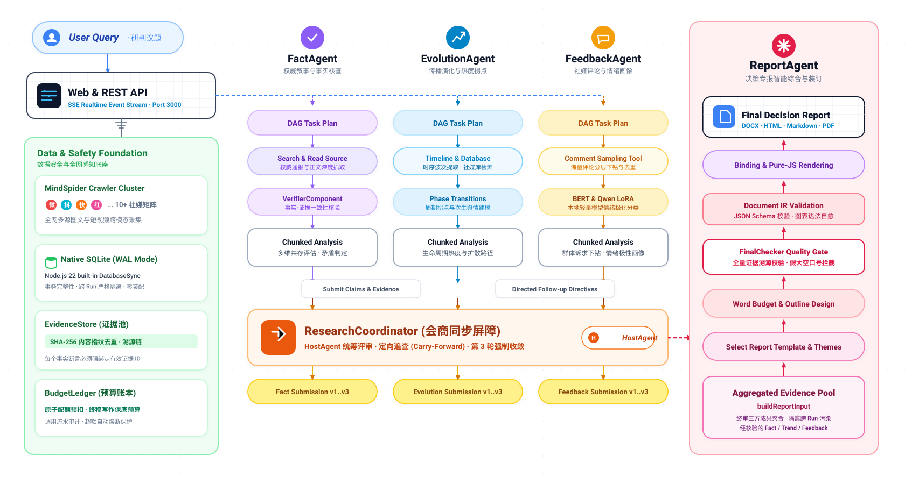

<div align="center">

# 观澜 · GuanLan
### 全媒体多智能体态势研判与决策专报平台
#### Multi-Agent Situation Awareness & Decision Reporting Platform

*“观水有术，必观其澜” —— 面向重大突发事件全网多源态势感知、多智能体会商博弈与受控专报装订的自主 Multi-Agent 系统*

[](https://nodejs.org/)
[](https://www.typescriptlang.org/)
[](https://python.org/)
[](./agent-runtime/)
[](./tests/)
[](LICENSE)

[English](./README-EN.md) | [中文文档](./README.md)

</div>

## ⚡ 项目概述

**「观澜」** 面向重大突发事件全网多源态势感知与研判决策场景，构建集**多源跨模态采集**、**多智能体会商博弈**与**受控专报装订**于一体的 Multi-Agent 舆情推演与内参生成平台。

系统打破了传统单一模型研判中的“信息茧房”与认知从众（Sycophancy）偏见，用户只需输入研判议题，系统即可驱动多智能体矩阵全自动完成权威叙事追踪、社媒跨模态感知、私有数据挖掘、异步会商博弈与受控编译级专报装订。

### 🚀 核心技术亮点

1. **现代 TypeScript 协同研判引擎 (`agent-runtime/`)**：
   - 核心研判中枢基于 TypeScript / Node.js 架构，承载自主任务规划、独立研究 Worker 池、串行防抖收件箱、双层预算门禁、严格证据溯源、IR 编译与决策专报装订，提供低延迟、强类型与高可靠的研判调度服务。
   - **原生高效底座**：基于 Node.js 22 原生 `node:sqlite`（WAL 模式）、Zod 强类型契约校验与 SHA-256 去重证据池。
   - **子 Agent 工具化与独立异步执行**：全面废除阻塞式同步屏障，将权威核查（`research_authority`）、态势演化（`research_evolution`）、舆情反馈（`research_feedback`）解耦为独立研究工具；后台 Worker 池异步并发执行，工具调用立即返回 `accepted` 任务回执。
   - **物理级故障隔离与终态不可变性**：单任务失败、超时或取消绝不级联中断同伴任务；成功结果持久化至 `task_results` 并具备版本唯一性保护，防止错误覆写。
   - **Pi 原生调用 ID 与双层预算门禁**：基于工具调用 `call_id` 进行独立额度预留，执行“单任务配额 + Run 全局预算”双层校验，硬性保留专报写作底线预算。
   - **HOST 串行防抖收件箱调度**：以 500ms 窗口智能聚合高频成果通知，全局互斥锁保障同一 Run 永远只有 1 个活跃 HOST 决策轮次，配备 12 轮上限熔断与空闲自动推进机制。
   - **修订上限（$\le 3$ 代）与 6 标准放行门禁**：实质性补查严格受限于 3 代，技术重试使用 attempt 计数；专报放行由 `ReleaseGate` 严格核验 6 项标准并冻结不可变材料快照，支持受限交付。
   - **全量自动化测试套件**：内建 **251 项** 自动化核心测试（112 个测试套件），全面覆盖 14 大系统级验收场景（并发异构结果隔离、单角色独立执行、超时晚到丢弃、级联取消、幂等去重、物理文件 SQLite 崩溃恢复等）。

2. **全媒体跨模态 Agent 矩阵架构**：
   - 权威叙事追踪、社媒跨模态感知与私有库情绪挖掘三层解耦的智能体矩阵。
   - 覆盖微博、小红书、抖音、快手等主流社媒图文、短视频及结构化卡片，实现全域态势的网格化感知。

3. **主控驱动的收件箱审查与自主工具调度**：
   - 采用首席分析师 Host 模型统筹与串行收件箱机制。
   - HOST 自主按需派发研究工具或通过 `delegate_research` 组合派发；针对收件箱中的新成果进行阶段审查，仅对必要信息缺口发起实质补查（上限 3 代），避免无效开销与大模型空转。

4. **端云分级协同与轻量微调降本**：
   - 构建“本地轻量模型打标 + 云端大模型高层研判”架构；基于 LoRA 微调本地 BERT-Chinese 与小参数 Qwen 模型，完成多维度情绪极化分类，测试集 F1-score 达 91.8%，显著降低推理调用成本。

5. **受控编译级 Document IR 装订引擎**：
   - 解决大模型长篇研报生成的结构坍塌与图表语法损坏问题，严格遵循 JSON Schema 的 Document IR 规范；实现篇幅预算拆解、章节流水线生成、Echarts 图表语法自愈校验与最终装订导出（DOCX / Markdown / HTML / PDF），报告全流程自动化出稿合格率达 95.2%。

---

## 🏗️ 系统架构

<div align="center">



</div>

### 一次完整研判决策流程

| 阶段 | 核心动作 | 参与组件 | 核心机制与输出约束 |
|---|---|---|---|
| **1. 议题接收与自主规划** | 接收用户研判议题，保存 Run 并启动初始 HOST 决策 | HostAgent + TaskPlanner | 建立 Run 隔离域，`runExecutionContext` 异步上下文绑定，HOST 按需自主规划任务 |
| **2. 独立工具调用与 Worker 并发** | 调用研究工具派发任务，后台独立 Worker 并发调研 | WorkerPool + ResearchTools | 返回即时 `accepted` 回执；最大并发 3；单任务隔离不级联失败；原子预算预留 |
| **3. 成果落库与防抖收件箱通知** | 成果原子写入 `task_results` 与 Outbox，收件箱消费唤起 HOST | OutboxRepo + HostInboxDispatcher | 500ms 窗口防抖合并多任务成果；单活 HOST 互斥锁确保决策串行有序，零事件丢失 |
| **4. 阶段审查与受限补查** | Host 综合新变化决策：通过、追查、等待或申请放行 | HostAgent + ReviewManager | **代数硬约束**：实质补查严格限制在 $\le 3$ 代；attempt 记录技术重试；12 轮决策上限熔断 |
| **5. 快照冻结与 6 标准放行门禁** | ReleaseGate 严格核验 6 准则，冻结不可变材料快照装订专报 | ReleaseGate + ReportAgent + Renderers | **6 标准门禁**：必要成果/缺口豁免、未调角色不适用说明、无在途事件、主张证据可解析、快照未失效、受限交付标记；ReportAgent 绑定冻结快照装订导出 |

---

### 项目代码结构树

```
GuanLan/
├── agent-runtime/                          # 🚀 TypeScript / Node.js 多智能体协同研判核心运行时
│   ├── src/contracts/                      # 统一领域契约 (研究作业、回执、成果、事件契约与 Zod 校验)
│   ├── src/storage/                        # SQLite 001/002 迁移、attempts/results/outbox/inbox 仓库、证据池与预算账本
│   ├── src/orchestration/                  # WorkerPool 异步工作池、HostInbox 串行防抖收件箱、ReleaseGate 放行门禁、调度与恢复
│   ├── src/tools/                          # 独立研究工具 (research_authority/evolution/feedback、delegate_research、submit_findings)
│   ├── src/agents/                         # Pi Agent 核心 (HostAgent, ResearcherAgent, ReportAgent, Verifier)
│   ├── src/runtime/                        # Pi 原生 callId 传递适配器、双层预算门禁与 TaskCancellationController
│   ├── src/reporting/                      # 不可变材料快照聚合、专报研判综合、Document IR 校验与多格式导出 (DOCX/HTML/MD/PDF)
│   ├── src/api/                            # RESTful API (含增量 outbox 拉取与单任务取消)、SSE 实时单任务流转事件流与 Web 看板
│   └── tests/                              # 251 项自动化核心测试 (覆盖 14 大系统级隔离与故障恢复验收场景，112 suites)
├── MindSpider/                             # 社交媒体多源数据采集与爬虫集群
│   ├── main.py                             # 爬虫主程序入口
│   ├── config.py                           # 爬虫配置文件
│   ├── BroadTopicExtraction/               # 热点话题宏观提取模块
│   ├── DeepSentimentCrawling/              # 深度舆情与多平台爬取模块 (微博/小红书/抖音等)
│   └── schema/                             # 数据库结构定义与初始化脚本
├── SentimentAnalysisModel/                 # 情感分析与端侧微调模型
│   ├── WeiboSentiment_Finetuned/           # 微调 BERT-Chinese / GPT-2 模型
│   ├── WeiboMultilingualSentiment/         # 多语言情感分析模型
│   ├── WeiboSentiment_SmallQwen/           # 小参数 Qwen 模型微调与离线推断
│   └── WeiboSentiment_MachineLearning/     # 传统机器学习分类基线
├── contracts/                              # 跨语言协议契约规范与 JSON Fixtures
├── docs/                                   # 架构设计方案与性能基准文档
├── static/                                 # 静态资源 (系统架构矢量图 framework.svg 等)
├── tests/                                  # Python 基础与跨模块工具测试
├── utils/                                  # 通用辅助工具函数
├── .env.example                            # 环境变量配置模板
├── config.py                               # 系统全局配置模型 (pydantic-settings)
├── docker-compose.yml                      # Docker 多服务编排
├── Dockerfile                              # 容器构建镜像定义
├── requirements.txt                        # Python 工具链依赖清单
├── README.md                               # 中文说明文档
├── README-EN.md                            # 英文说明文档
├── CONTRIBUTING.md                         # 中文贡献指南
├── CONTRIBUTING-EN.md                      # 英文贡献指南
├── LICENSE                                 # GPL-2.0 开源许可证
└── THIRD_PARTY_NOTICES.md                  # 第三方开源声明
```

---

## ⚡ 极速开始：多智能体研判运行时（推荐）

「观澜」的核心研判调度运行时位于 `agent-runtime/` 目录。启动后提供交互式 Web 看板、全流程 RESTful API 与 SSE 实时会商事件流：

### 1. 运行环境要求
- **Node.js**: 20.x 或 22.x LTS
- **npm**: 10.x+

### 2. 安装与启动

```bash
# 1. 进入运行时目录
cd agent-runtime

# 2. 安装依赖并编译构建
npm install
npm run build

# 3. 运行全量 251 项自动化核心测试 (112 个测试套件，覆盖 14 大系统级验收场景)
npm test

# 4. 启动研判服务与 Web 交互看板
npm start
```

服务启动后，在浏览器中打开：**`http://localhost:3000`**

### 3. API 交互快速上手

- **创建研判任务**：
  ```bash
  curl -X POST http://localhost:3000/api/research/runs \
    -H "Content-Type: application/json" \
    -d '{"topic": "新能源汽车充电基础设施建设舆情研判"}'
  ```

- **监听会商实时事件流 (SSE)**：
  ```bash
  curl -N http://localhost:3000/api/research/runs/<RUN_ID>/events
  ```

- **下载决策专报**：
  - HTML 交互报告：`GET http://localhost:3000/api/research/runs/<RUN_ID>/report.html`
  - Markdown 专报：`GET http://localhost:3000/api/research/runs/<RUN_ID>/report.md`
  - Word 文档：`GET http://localhost:3000/api/research/runs/<RUN_ID>/report.docx`

详细架构与接口规范请参阅：[Node.js 运行时开发者指南](./docs/guides/node-runtime.md)

---

## 🚀 完整系统部署（Docker 全组件）

### 1. 配置环境变量
复制环境配置模板：
```bash
cp .env.example .env
```
编辑 `.env` 文件，填入您所使用的大模型 API 密钥（兼容所有遵循 OpenAI 标准的模型提供商）。

### 2. 启动服务
```bash
docker compose up -d
```
启动成功后，浏览器访问 `http://localhost:3000` 即可进入系统看板。

---

## 🐍 Python 辅助模块使用指南

系统由 **TypeScript 核心运行时**（负责多智能体任务调度、证据链条约束、会商收敛及决策专报装订）与 **Python 算法/采集组件**（负责全网社媒爬取及端侧情感分析）协同工作。

### 1. Python 环境配置

```bash
# 推荐使用 Conda
conda create -n guanlan python=3.11 -y
conda activate guanlan

# 安装 Python 工具链依赖
pip install -r requirements.txt

# 安装 Playwright 浏览器内核 (用于社媒爬虫)
playwright install chromium
```

### 2. MindSpider 社媒采集集群

MindSpider 支持对微博、小红书、抖音等主流社交平台进行宏观热点跟踪与深度评论采集：

```bash
cd MindSpider

# 1. 数据库初始化 (创建舆情与爬虫任务表)
python -m schema.init_database

# 2. 运行宏观热点话题发现
python main.py --broad-topic

# 3. 运行深度舆情采集 (支持指定平台: xhs/dy/wb)
python main.py --deep-sentiment --platforms xhs dy wb
```
详细配置请阅读：[MindSpider 使用说明](./MindSpider/README.md)

### 3. 情感分析与轻量模型推断

系统内置了多种情感分类与极化分析模型：

```bash
# 1. 小参数 Qwen 模型通用推断
cd SentimentAnalysisModel/WeiboSentiment_SmallQwen
python predict_universal.py --text "这次政策调整非常及时，解决了大家的顾虑"

# 2. 中文 BERT LoRA 模型推断
cd ../WeiboSentiment_Finetuned/BertChinese-Lora
python predict.py --text "服务质量令人满意"

# 3. 多语言舆情情感推断
cd ../../WeiboMultilingualSentiment
python predict.py --text "The overall response is remarkably positive." --lang "en"
```

---

## ⚙️ 核心配置说明

所有配置均由根目录 `.env` 统筹管理，核心配置项如下：

| 配置组 | 配置项 | 说明 | 推荐/默认值 |
|---|---|---|---|
| **服务配置** | `PORT` | 研判运行时端口 | `3000` |
| | `HOST` | 监听地址 | `0.0.0.0` |
| **数据库** | `DB_DIALECT` | 数据库类型 | `postgresql` / `mysql` |
| | `DB_HOST` / `DB_PORT` | 数据库主机与端口 | `localhost:5432` |
| | `DB_USER` / `DB_PASSWORD` | 数据库认证账号 | 自定义 |
| | `DB_NAME` | 数据库名 | `guanlan` |
| **通用大模型** | `OPENAI_API_KEY` | 大模型 API Key | 兼容 OpenAI 格式 |
| | `OPENAI_BASE_URL` | 大模型 API Base URL | 默认 `https://api.openai.com/v1` |
| | `OPENAI_MODEL_NAME` | 默认研判大模型 | `gpt-4o` / `deepseek-chat` |
| **定向智能体** | `HOST_AGENT_MODEL_NAME` | 主持研判 Host 模型 | 推荐 `qwen-plus` 或 `deepseek-reasoner` |
| | `FACT_AGENT_MODEL_NAME` | 事实核查 Agent 模型 | 推荐 `deepseek-chat` |
| | `EVOLUTION_AGENT_MODEL_NAME` | 态势演化 Agent 模型 | 推荐 `kimi-k2-0711-preview` |
| | `FEEDBACK_AGENT_MODEL_NAME` | 舆情反馈 Agent 模型 | 推荐 `gemini-2.5-pro` |
| **外部搜索** | `TAVILY_API_KEY` | 全网实时搜索 API 密钥 | [Tavily](https://tavily.com/) |
| | `SEARCH_TOOL_TYPE` | 智能体联网检索源 | `AnspireAPI` / `BochaAPI` |

---

## 🤝 贡献指南

我们欢迎所有形式的贡献！无论提出 Issue 还是提交 Pull Request，请遵循项目开发规范。

**请阅读详细指南：** [CONTRIBUTING.md](./CONTRIBUTING.md)

---

## 🗺️ 后续演进路线

- [x] **现代 TypeScript / Node.js 高并发调度引擎**（已完成：全量单元基线测试通过）
- [x] **子 Agent 工具化与独立异步执行引擎**（已完成：14 大系统级验收场景、251 项测试全绿通过）
- [x] **受控编译级 Document IR 装订与纯 JS 导出**（已完成：DOCX / Markdown / HTML / PDF）
- [ ] **多模态图生文/图生表深度融合研判**：支持短视频逐帧解构与多模态图表统一对齐
- [ ] **端侧轻量化模型蒸馏**：将研判推理策略蒸馏至小尺寸模型，实现全离线私密研判
- [ ] **高并发动态拓扑路由**：基于研判议题自适应伸缩子智能体数量与关注维度

---

## ⚠️ 免责声明

**重要提醒：本项目仅供学习、学术研究和教育目的使用**

1. **合规性声明**：
   - 本项目中的所有代码、工具和功能均仅供学习、学术研究和教育目的使用。
   - 严禁将本项目用于任何违法违规、侵犯公民个人隐私或扰乱网络公共秩序的行为。

2. **采集功能免责**：
   - 项目中的数据采集功能仅用于技术研究与学术数据样本分析。
   - 使用者必须遵守目标站点的 robots.txt 协议与使用条款，严禁高频攻击或违规采集。
   - 因使用数据采集工具造成的任何法律后果由使用者自行承担。

3. **研判内容免责**：
   - 智能体会商研判与专报输出内容由大模型基于检索证据综合生成，平台不对报告观点的绝对真确性提供明示或默示的担保。
   - 决策专报仅作为辅助分析参考，不构成法定决策结论。

---

## 📄 许可证

本项目基于 [GPL-2.0 License](LICENSE) 开源。

---

## 📬 交流与支持

- 📧 **联系邮箱**：`ethan.jyh1205@gmail.com`
- 💬 **问题反馈**：欢迎通过 [GitHub Issues](https://github.com/Ethan-jyh/GuanLan/issues) 提交 Bug 或建议。
