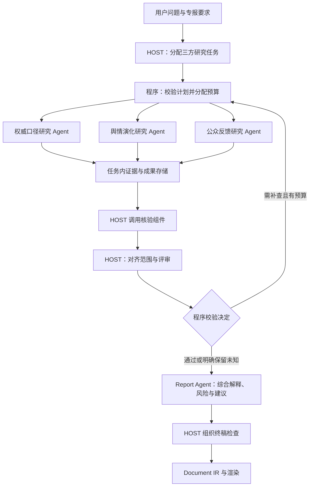
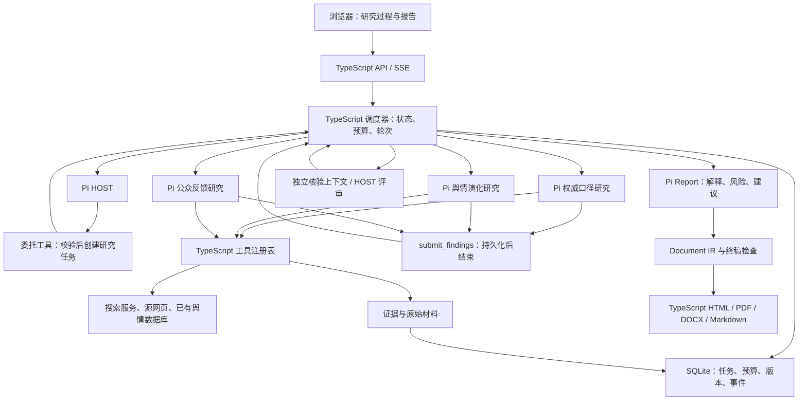

# BettaFish TypeScript + Pi 三方研究架构设计方案

日期：2026-10-01  
原始设计参考基线：`6c32b6b`（历史对照，不代表当前工作区全部实现）  
状态：采用 TypeScript 统一核心及 Pi 执行层；替代此前 Python 调度与 TypeScript 执行服务的混合方案。技术方案待实现。本文只设计架构，不表示相关能力已经实现或验证。

## 1. 目标与范围

将现有三个引擎、HOST 阶段会商的结构，重构为 HOST 主 Agent 调度三位职责固定的研究子 Agent、组织核验与补查，再由 Report Agent 完成综合研判和专报写作的系统。

目标是明确分工、减少重复研究、让关键结论可追溯，并使并行研究的成本、停止条件和异常恢复可控。多 Agent 的效果需要和单 Agent 在相近预算下比较，不预设其必然更好。

本次讨论已经确认的方向：

- 可以大幅重构，甚至重新组织项目，不受现有目录与角色名称限制。
- HOST 主 Agent 将三位研究子 Agent 作为工具调用，分配具体调查任务。
- 固定分工为权威口径研究、舆情演化研究、公众反馈研究；研究范围可同时覆盖境内外。
- 三位研究子 Agent 首轮并行执行，提交结构化研究成果后等待 HOST；后续只执行针对自己的补查任务。
- HOST 负责对齐研究范围、核验与评审、协调补查和放行，不代替 Report Agent 完成最终风险与对策分析。
- Report Agent 基于核查后的三方成果形成整体解释、风险判断和针对性建议，再组织成专报，不降为仅拼接和排版的服务。
- 新系统的 API、Agent 执行、调度、预算、证据、报告与导出统一使用 TypeScript；标准流程不依赖 Python 服务。
- 本次只输出设计文档，不修改运行代码。

推荐并在本方案中采用的设计选择：

- 标准专报任务配置一个 HOST、三个研究子 Agent 和一个 Report Agent；核验是 HOST 可调用的组件，不额外强制设置一个常驻核验 Agent。
- 三方角色固定，HOST 动态指定各方的主体、平台、地区、时间范围和补查问题，不按报告章节或临时主题更换角色。
- 简单任务可明确选择需要的研究角色；未启用的角色记录为不适用，不能伪造其研究成果。标准专报默认三方全部参加。
- 研究子 Agent 内部采用模型决定下一步动作的有界循环。
- 采用 Pi 的 Agent 核心作为执行层，保留本项目的研究角色、证据契约、调度约束与报告能力；具体版本及集成效果在实施阶段验证。
- 核验组件使用单独上下文检查主张，可读取原始材料并按需调用检索工具；由 HOST 消费其结果并组织评审。
- 研究成果优先为结构化证据简报，不要求子 Agent 各写完整文章。
- 最多三轮研究成果核验与补查；允许提前结束。
- 将 ReportEngine 的综合分析、模板与 IR 设计迁移到 TypeScript，渲染与研究判断分离；不继续调用旧 Python 写作链。

后文预算默认值、工具接口和核验组件实现方式属于技术建议。第2节现状对照基于原始设计参考提交；工作区可能已有后续混合架构实现，不能把它们视为本 TS 方案已实现。实施前需要重新盘点当前代码。

## 2. 原始系统与重构动机（历史基线对照）

当前 `QueryEngine` 使用公开网页搜索工具，`MediaEngine` 使用媒体/多模态搜索工具，`InsightEngine` 使用本地舆情数据库及情感分析等能力。

新加入的 `ForumEngine` 已有阶段提交、HTTP 轮询、SQLite 存储、检查点、HOST 定向派单以及报告登记机制。三个引擎在整份初步研究完成后进入评审，之后生成各自的最终报告。

当前值得重构的边界：

1. 当前三个角色按搜索渠道及数据能力区分，网页研究有重叠；新分工按需要回答的问题和验收标准划分。
2. 主研究方向主要由各子 Agent 自己展开，HOST 在成果汇合后介入。
3. 当前单 Agent 的控制流程由 Python 节点固定编排，反思次数主要由配置决定。
4. 三方各自写完整文章后再汇总，会重复组织背景，也可能丢失结论与证据的对应关系。
5. 现有补充任务执行主要追加检索情况，不能等同于完成证据分析与结论修订。

新结构复用已有数据、提示词、报告模板、IR 样本与静态资产，将工具、调度和渲染实现迁移到 TypeScript。旧 Python 项目保留为独立对照与回退入口，不参与新任务执行。

## 3. 角色与职责

| 角色/组件 | 负责什么 | 不承担什么 |
|---|---|---|
| HOST 主 Agent | 解析需求、指派三方任务、分配预算、对齐研究范围、组织核验与评审、安排补查和放行 | 不替三方编造研究结果，不承担最终综合报告的风险与建议写作 |
| 权威口径研究 Agent | 调查相关机构原始声明、回应及口径变化，核对各方公开表态 | 不把机构声明直接认定为全部事实，不替公众反馈研究推断接受程度 |
| 舆情演化研究 Agent | 分析可获得的热度数据、传播阶段、关键节点与转折点 | 不把同期事件直接写成变化原因，不代替公众反馈研究进行总体态度归纳 |
| 公众反馈研究 Agent | 分析评论与帖子中的观点、情绪、诉求和群体差异 | 不用评论证明事件事实，不将局部样本推广为全体公众态度 |
| 核验组件 | 检查主张与证据、时间及样本口径，必要时读取原文或独立检索 | 不管理调度状态，不替 HOST 放行，也不提供无依据的真值裁决 |
| 程序调度器 | 创建执行实例、并发控制、预算、事务、超时、取消与恢复 | 不依赖自由文本决定任务状态 |
| Report Agent | 综合核查后的三方成果，形成整体解释、风险与建议，完成专报写作及结构化文档内容 | 不新增无来源的事实，不绕过 HOST 隐式开展新研究 |
| 文档渲染服务 | 校验与渲染 Document IR，按目标格式导出 | 不修改已确认的实质判断 |

典型任务有五个业务 Agent：一个 HOST、三个并行研究子 Agent、一个 Report Agent。核验组件可以有模型调用与工具能力，但不独立制定研究计划，也不是第六位必须全程运行的业务角色。

Report Agent 的输出必须包含跨三方成果的综合判断，不能只复述三份简报。核验研究材料是否可信由 HOST 组织，决定这些材料对事件解释、风险与建议意味着什么由 Report Agent 承担。Report Agent 的新推断必须标明依据和条件，并接受终稿检查。

## 4. 架构与执行流程



流程：

1. 创建唯一 `run_id`，保存用户问题、范围、输出要求和预算快照。
2. HOST 根据三方固定职责生成研究计划；程序检查范围、依赖、工具权限、完成标准和预算。
3. 标准专报首轮同时启动三方，同步研究同一事件、共同时间窗口和各自的调查范围。确有依赖的补查任务按条件执行。
4. 每个研究实例独立执行研究循环，保存材料、工具观察、结论和未解决问题。
5. 本轮所需角色都提交结果或明确的数据不足说明后，HOST 调用核验组件检查关键主张。执行失败不算有效提交，按异常规则暂停。
6. HOST 对齐三方时间、主体、平台和统计口径，检查分歧及遗漏，提出补查或放行决定，程序执行合法状态转移。
7. 补查仅调度相关任务；已完成结果按版本沿用，不要求所有研究员重做。
8. 放行后 Report Agent 综合三方成果，形成事件解释、风险及建议，再完成章节与摘要。HOST 组织终稿检查，检查新推断、引用及不确定性表达。
9. 保存结构化文档并渲染；输出未解决事项、研究限制及引用。

第一版采用三方汇合后评审。研究阶段最多三轮成功的 HOST 评审；终稿检查另有有限修订预算，不新增研究轮次。

## 5. 三方任务、输入输出与并行边界

HOST 为每位研究 Agent 指定：目标问题、调查范围、工具范围、排除事项、完成标准、依赖和预算。角色职责固定，具体任务动态变化。

| Agent | 输入 | 必须输出 | 验收标准 |
|---|---|---|---|
| 权威口径研究 | 事件、相关机构、时间及地区范围 | 原始声明与出处、回应时间线、口径变化、已回应及未回应问题 | 表态可追溯；区分机构声明、媒体报道和评论；未发现回应时说明检索范围，不断言所有机构均未回应 |
| 舆情演化研究 | 事件关键词、监测范围、时间序列及传播记录 | 热度变化、阶段划分、转折点、同期关键事件 | 指标、基线、平台及时间窗口明确；阶段有数据依据；区分相关与因果；数据不足时仅描述已观察节点，不编造热度曲线 |
| 公众反馈研究 | 评论/帖子样本、平台、时间窗口、去重与采样要求 | 主要观点、情绪与诉求、群体差异、时间变化、代表性原文 | 分类有样本支撑；保留样本量、去重和采样限制；不推测未提供的人口身份；不将样本比例写成全体公众比例 |

“权威口径”限定为可追溯的相关机构公开立场和正式材料。主流媒体报道可提供背景与转引线索，媒体社评和专家观点单独分类，不作为官方立场或已证实事实。境内外来源均按这一规则处理。

舆情演化必须区分不同指标，例如帖子数、互动量、搜索指数；不同指标不能未经说明拼成同一热度曲线。转折点需说明判定方法，因果解释若缺证据只能作为待核查假设。

公众反馈应区分情绪指向对象、观点与诉求；“反对某项措施”不能直接等同于“对整个事件持负面情绪”。点赞数和高互动评论不能直接代表观点人口比例。

舆情问题示例：“某高校回应后，争议是否平息？”

| 任务 | 范围 | 交付 |
|---|---|---|
| 权威口径研究 | 回应主体、原始表态、回应时间及内容 | 回应覆盖了什么，哪些问题没有明确涉及 |
| 舆情演化研究 | 回应前后相同窗口中的指标与传播节点 | 热度与阶段怎样变化，哪些事件与转折同时出现 |
| 公众反馈研究 | 同期评论/帖子中的观点、情绪与诉求 | 公众怎样理解回应，样本内质疑集中在哪里 |

三方统一提交主要发现、支持材料、时间/平台/主体范围、相对上一轮的变化和未解决问题。境内外是成果的地区维度，不是新的 Agent 分工；报告章节也不与某一 Agent 一一绑定。

三方可以读取同一回应材料：权威口径研究关注其内容，演化研究关注同期传播变化，反馈研究关注受众反应。共享材料合理，重复交付同一研究结论应由 HOST 识别并调整。

同一研究任务可以使用多个工具；工具权限由任务需求决定。权威口径角色优先使用来源检索/原文读取，演化角色优先使用监测及时间序列工具，反馈角色优先使用评论查询、分类和情感分析。工具能力不因目录名被永久锁死。

程序校验结构、预算、依赖和已配置的数据来源；HOST 判断任务是否重复、是否遗漏核心问题以及范围是否可比较。语义上的质量判断不能假定由简单字段校验自动完成。

基础公开资料可以按来源缓存去重；首轮研究员不直接接收其他研究员的结论，以减少相互锚定。后续需要解释分歧时，通过任务消息显式提供相关主张和证据。

## 6. 子 Agent 作为工具与内部研究循环

HOST 面向研究委托接口，例如 `delegate_research`，通过 `agent_role` 选择三位子 Agent 之一。调用返回任务句柄，程序同时调度首轮三项任务，再等待汇合，不依次阻塞。

接口语义：

```json
{
  "run_id": "run_example",
  "subtask_id": "subtask_a",
  "agent_role": "authority",
  "objective": "核对相关机构原始回应、口径变化与回应覆盖问题",
  "scope": {
    "time_range": "用户指定范围",
    "required_sources": ["原始声明", "可追溯报道"]
  },
  "allowed_tools": ["web_search", "read_source"],
  "completion_criteria": ["表态及日期可追溯", "媒体评论单独分类", "未回应及未核实问题单列"],
  "budget": {"max_tool_calls": 12}
}
```

字段示例用于说明契约，不表示当前接口已存在。建议角色标识为 `authority`、`evolution`、`feedback`。现有 `query`、`media`、`insight` 不在文档阶段直接改名；实施时需明确兼容映射，不将原工具配置直接等同于新角色职责。

子 Agent 内部循环：

```text
读取任务、已有观察和预算
→ 模型输出结构化动作
→ 程序校验并执行工具
→ 将工具结果加入上下文与持久化状态
→ 模型判断继续调用工具，或提交研究成果
```

动作类型为 `call_tool` 和 `finish`。`call_tool` 包含工具名、参数、当前核查目标及简短理由；`finish` 包含结论、证据关联、覆盖情况与未解决事项。运行记录不要求保存模型隐含思维链。

模型提出结束只是结束自身任务。程序校验成果结构、必要证据字段和任务完成情况，不能把一次 `finish` 当作整个研究已通过。

第一版采用第11节的 Pi 执行层实现这一契约；`call_tool` 与 `finish` 是业务动作语义，分别映射为 Pi 原生工具调用与 `submit_findings` 提交，不另造一套文本动作解析循环。稳定的运行协议保留框架替换空间，框架不是 Agent 自主性的判定依据，也不要求为文档安装依赖。

## 7. 研究成果与证据模型

共享存储按 `run_id` 隔离。研究员只写自己的任务结果；已提交版本不可覆盖，通过新版本修订。

核心记录：

- `Run`：用户问题、范围、状态、预算、当前评审轮次、操作版本。
- `ResearchTask`：角色、具体问题、地区/主体/平台/时间范围、依赖、执行实例、状态、预算、验收条件。
- `Evidence`：来源、摘录、检索时间、来源日期、原始材料引用、来源类型。
- `Claim`：具体主张、关联证据编号、时间与适用范围、研究员标记的限制。
- `ResearchResult`：角色、发现/主张、证据、范围、相对上一轮变化、覆盖清单、未解决事项、工具摘要，以及下述角色专属成果。
- `AuthorityFinding`：表态主体、来源类型、发布时间、原文、口径变化、回应覆盖及未回应问题。
- `EvolutionFinding`：指标定义、平台和窗口、数据点与缺失、阶段/转折判定方法、同期事件、关联判断及限制。
- `FeedbackFinding`：采样与去重方法、样本量、观点/情绪/诉求分类、计数与分母、代表性材料、群体依据及限制。
- `Verification`：被核验的主张版本、结论、理由、补充证据和建议核查任务。
- `ReportJudgment`：Report Agent 的跨三方解释、风险及建议，关联的研究主张/证据、适用条件、替代解释与不确定性。
- `Artifact`：报告版本、使用的研究与判断版本、终稿检查结果、IR 和输出文件路径。

证据规则：

1. 来源日期与检索日期独立存储；抓取日期不能当作发布日期。
2. 搜索摘要与已读取正文使用不同的来源标记，不能声称只凭摘要完成原文核实。
3. 私有数据保存内部记录/查询引用，不伪造公开链接。
4. 转引同一原始材料的多个网页不能直接视为多个独立证据。
5. 评论观点不能直接证明事件事实；官方声明也不等于支持所有后续推断。
6. 数据分析保留时间范围、平台、采样方式和分母；没有数据时明确无法判断。

模型只读取本次提供的上下文。完整材料保存在证据存储，模型可用检索/读取工具按需查看。压缩后的研究简报仍保留主张和证据编号，使后续步骤能追溯原始材料。

## 8. HOST 评审、核验与停止条件

HOST 调用的核验组件获得主张、关联来源、任务范围和原始材料读取能力，使用独立于研究员的核验上下文。HOST 结合核验结果开展三方评审，不因多人同意就认定主张成立，不强行达成共识。

每条关键主张返回：

- `supported`：指定范围内有足够支持证据。
- `partially_supported`：证据只支持部分措辞或范围。
- `unsupported`：现有材料不足以支持。
- `contradicted`：有直接冲突证据，需要核查。
- `uncertain`：材料不足、数据不可得或无法比较。

这些是可审计的核验判断，不是绝对真值。核验结果必须附理由及证据引用，也可以被后续证据修订。

“官方已回应”“新增报道减少”“评论仍有质疑”可能同时成立。核验先比较主张指向的对象、时间、样本与口径，避免把不同维度误当矛盾。

核验针对重要主张及抽样证据开展；第一版不保证穷尽所有资料。核验组件可调用工具补证，无法解决时给出 `uncertain`，由 HOST 决定安排补查或保留限制。

HOST 重点对齐：三方是否在研究同一阶段、同一平台和同一对象；热度的绝对量与负面观点比例是否混淆；机构口径变化与公众诉求变化是否被充分调查。它给出可执行的补查任务及完成标准，不要求所有 Agent 每轮都行动。

评审最多三轮：初次研究成果对应第1轮；补查后第2轮；再次补查后第3轮。失败重试不增加成功评审次数。没有“必须连续两轮无修改建议”的规则。

前两轮可提前成稿。第3轮不再新增研究批次：有依据的主张进入正文，未解决事项进入限制或分歧说明；未经支持的确定性说法不得因轮次耗尽而自动通过。

允许 Report Agent 成稿的条件：本轮所需角色均有有效成果；核心研究问题已覆盖或明确标记无法覆盖；关键材料已核验；没有尚在执行的必要任务；未解决事项均有状态和说明。程序检查结构和预算，HOST 作出有依据的质量判断，二者共同形成放行记录。

## 9. 预算、异常与恢复

推荐默认值，均可配置并在创建任务时固定：

| 参数 | 建议值 | 语义 |
|---|---:|---|
| 最大研究并发 | 3 | 标准任务首轮三位角色并行，补查最多并行三位 |
| 最大评审轮数 | 3 | 成功的成果核验轮数 |
| 每个初始研究任务工具预算 | 12 | 成功与失败的外部工具执行尝试都计入 |
| 核验工具预算 | 8 | 整个任务内核验阶段累计使用 |
| 全任务工具预算 | 50 | 包含初始研究、核验和补查；重试也消耗 |
| 全任务执行期限 | 30分钟 | 超时暂停，不静默生成报告 |
| 单个外部调用自动重试上限 | 2 | 仅适用于可重试错误，仍受总期限和预算限制 |

模型调用另有总 token/费用上限，由配置与模型定价决定；不能仅靠工具次数约束写作和规划成本。程序在预算中为成稿及终稿检查预留额度，实际用量记录在运行结果中。

预算不足时，在调用前停止扩大调查。正常预算耗尽可以提交带未解决事项的成果，经核验明确限制后成稿；工具故障、必要任务失败、超时和存储异常会暂停任务。二者分开记录，不能把执行失败伪装成“没有找到证据”。

SQLite 保存调度状态、消息、结果和预算，原始材料与检查点存储在任务隔离目录。第一版由一个 Node.js 应用持有 TypeScript 调度器，以有界异步任务执行三方研究、HOST 核验和 Report Agent。子 Agent 是逻辑独立实例，不分别启动服务；同步数据库事务保持短小，PDF 等重任务使用受限队列，避免阻塞 API。

一致性：

- 每次工具调用有 `call_id`，每次委托有幂等键；重复请求返回原任务或结果。
- 状态转移与工作领取使用事务，不能只依赖“先读后写”和内存锁。
- 取消或恢复增加操作版本，迟到的模型结果不能更新新版本状态。
- 客户端超时不代表底层调用已停止；未能中断的调用返回后校验版本并丢弃过期结果。
- 检查点包含任务、材料引用、已消费预算、待处理动作和执行版本。
- 重启将未结束任务转为暂停；恢复从持久化检查点继续，不刷新已消费预算。
- 报告生成失败只重试报告阶段，不重跑已完成研究。

## 10. 报告生成与页面展示

HOST 放行后调用 Report Agent，输入为：用户要求、三方各自的有效成果版本、证据、核验/评审记录、未解决事项及专报模板要求。

Report Agent 必须完成三项实质工作：

1. 整体解释：结合权威回应、舆情演化和公众反馈，分析现象之间的关系，区分可确认关系、待核实解释与替代解释。
2. 风险研判：写明观察依据、可能后果、受影响对象和触发条件；不能只给泛泛的“可能发酵”判断。
3. 应对建议：说明建议针对什么风险/诉求、由谁行动、怎样行动、预期作用及可能限制。没有依据时明确缺口，不补造材料。

它统一形成报告，不拼接三篇子 Agent 文章。复用 ReportEngine 的模板、布局规则与 IR 样本，在 TypeScript 中实现章节组织、校验与组装；渲染是独立模块，不另建 Python 报告服务。

参考实验室样稿的默认结构：

```text
标题
摘要（正文与研判完成后生成）
一、事件概述与舆论发展趋势
二、境外舆论
三、境内舆论
四、风险研判与应对建议
```

三位研究员的成果共同支撑各章。权威口径包含境内外机构，公众反馈包含境内外样本；不能将两章分别绑定为两个 Agent。章节和地区范围按具体主题调整，风险及建议数量不硬编码，也不机械要求一一对应，但每项建议要说明对应的问题。

HOST 组织终稿检查：新写出的事实是否有依据，ReportJudgment 是否从已核验材料合理推出，风险与建议是否具体，引用是否相关，日期数字和不确定性是否一致。采用确定性检查和模型抽查；问题返回 Report Agent 在有限写作修订预算内重写，不算新增研究评审轮次。HOST 检查质量，不直接代写全部风险与建议。

写作阶段发现需要新研究才能解决的重大问题时，标记未解决或暂停待用户处理；不能绕过三轮上限隐式搜索。

Document IR 表示文档结构与内容，采用版本化 TypeScript 契约。新系统在 TypeScript 中实现 HTML、Markdown、PDF 和模板驱动的 DOCX 导出，保留样稿层级、样式及原生引用。旧渲染器用于参考与输出对照，不在标准流程中调用；迁移按支持的 IR 块逐一验收，遇到未支持块显式报错，不静默丢弃。当前不宣称新导出能力已实现。

页面展示任务拆解、各研究员状态、关键发现、核验问题、补查、预算及报告阶段。论坛页可以演进为研究过程时间线；不用模拟轮流发言。报告标识和输入按 `run_id` 绑定，不使用目录最新文件猜测任务对应关系。

## 11. TypeScript 统一核心与技术选型

### 11.1 总体决策

新系统采用模块化单体：一个 Node.js 应用、一个统一 TypeScript 业务核心、一个调度状态库。API、Pi 实例、工具、预算、证据和报告模块通过进程内接口连接，首版不引入微服务、消息中间件或第二套 Python 调度状态。

Pi 处理模型请求、原生工具调用、观察回传与流式事件。本项目处理角色、任务、评审、预算、持久化及成果契约。程序决定哪些动作合法，模型决定在合法范围内如何研究；整个系统并非让模型自由运行到自行宣布成功。

截至 2026-10-01 核查，原 `badlogic/pi-mono` 官方地址重定向到 `earendil-works/pi`，核心包为 `@earendil-works/pi-agent-core`，模型适配包为 `@earendil-works/pi-ai`。采用核心 SDK，不直接把编程 CLI 当研究系统。实施前锁定发布版本与 Node.js 要求，并验证所用模型的工具调用、取消及会话恢复接口。

### 11.2 系统结构



图中是逻辑模块与实例，不代表每个框各启动一个服务。标准研究首轮最多三个独立研究实例并行；HOST 在提交后被唤醒评审，不通过模型轮询任务是否完成。

### 11.3 技术栈与运行边界

| 层 | 首版选择 | 理由与边界 |
|---|---|---|
| 运行时 | Node.js + TypeScript strict 模式 | 单语言核心；运行时版本在 Pi 兼容验证后锁定 |
| Agent | Pi Agent Core + Pi AI | 角色独立实例；包版本固定，接口变更集中在适配层 |
| API | Fastify + SSE | HTTP 管理任务，SSE 展示可恢复的执行事件；可用静态页面先交付 |
| 业务契约 | Zod + 导出的 JSON Schema | 一份运行时校验契约，派生 TS 类型；工具参数映射到 Pi 接受的 Schema，不重复手写两套定义 |
| 调度/证据元数据 | SQLite + TS repository 层 | 单机首版、短事务、迁移版本；具体驱动先验证支持的 Node 版本和事务能力 |
| 原始材料 | 按 run_id 分目录的文件存储 | 正文与大样本不全塞模型上下文；记录内容指纹和材料引用 |
| 工具 | TypeScript 函数与供应商 HTTP API | 搜索、原文读取、数据库查询、统计和样本分类均由 TS 调用 |
| 报告 | TS Document IR + 模板 | 保留旧 IR 意图，明确版本和支持的块，不承诺零改动兼容全部旧块 |
| 导出 | HTML/Markdown 模块；Playwright Chromium PDF；docx 候选库 | TS 实现，中文字体、脚注、分页须用样稿验收；浏览器进程不构成 Python 内核 |
| 测试 | Node 测试运行器 + 脚本化模型；Playwright 页面检查 | 普通测试不默认调用收费模型，真实模型集成测试独立执行 |

Fastify、Zod、docx 与 Playwright 是本方案的工程选择，已核查官方文档，但尚未完成本项目集成。实施阶段验证 PDF 的 Chromium 环境和 DOCX 的原生引用能力；若候选库不能满足模板需求，在 TS 层更换实现，不退回 Python 调度内核。

### 11.4 HOST 与程序的控制协议

1. 创建运行后，调度器启动 HOST 规划阶段。HOST 通过 `submit_plan` 提交结构化计划，程序检查角色、范围、工具权限、依赖和预算。
2. `delegate_research` 是 HOST 的研究委托工具，返回任务句柄；首轮委托先登记，完整计划提交后由调度器事务化确认所需任务并统一派发，避免模型只启动部分任务就进入评审。
3. 研究实例通过工具注册表获取数据。工具结果进入 Pi 上下文，同时保存调用记录与证据；模型自行决定继续补查或调用 `submit_findings`。
4. `submit_findings` 校验角色成果、引用归属和执行版本，持久化成功后终止本次研究调用。普通文本或 `agent_end` 事件不等于业务任务有效提交；未提交的实例按有限修正额度处理，仍失败则暂停。
5. 调度器只在本轮所需任务均有效提交后唤醒 HOST；未补查角色引用已提交版本，不重复调用。HOST 调用核验组件后以 `submit_review` 提交决定，程序执行合法状态转移。
6. 放行后启动 Report。Report 提交判断及 IR，经 HOST 组织终稿检查、有限修订后生成 Artifact；导出失败只重试导出，不重跑研究和写作。

主运行状态为 `planning → researching → reviewing → approved → writing → final_check → completed`，补查由 `reviewing` 回到 `researching`；暂停、取消单独记录。导出任务有独立状态，报告内容完成与目标格式全部交付区分展示。子任务状态与主状态独立维护。

Pi 会话消息保存模型上下文；业务状态只以统一数据库记录为准。核验使用隔离上下文，不能共享研究员的隐含判断或被多人同意代替原文核查。

### 11.5 工具、数据与报告迁移

| 旧资产 | TypeScript 处理方式 |
|---|---|
| QueryEngine 的搜索服务调用 | 迁移参数、解析及错误处理；通过供应商 API 直接调用，不调用旧 Python Agent |
| MediaEngine 的网页/媒体检索 | 迁移为工具适配器，保留来源类型、转引与原文标记；不因旧目录划分角色 |
| InsightEngine 的数据库 | TS 只读数据连接器访问原有数据表，保留查询范围、平台和分母；模型不直接生成任意 SQL |
| 情感分析 | 首版采用模型 API + TS 批量分类工具，保留可审计标签和样本；与旧本地分类器的质量、费用和隐私差异单独评估 |
| 数据采集系统 | 首版消费已有数据库或外部数据接口；不宣称已用 TS 重写全部爬虫，也不自动承诺全网覆盖 |
| ForumEngine | 重写调度与状态逻辑，复用行为测试场景；新状态库不直接覆盖旧论坛库 |
| ReportEngine | 迁移模板、章节/布局规则、IR 样本与静态资源，在 TS 实现写作适配、校验、渲染 |
| Flask / Streamlit | 新研究入口由 TS API 与页面承接；旧应用只作为独立历史入口 |

标准新流程能独立启动和完成，不要求启动任何 Python 进程。既有采集程序可以继续独立更新旧数据库，这是上游数据来源，不承担新系统的调度或成果提交。输入数据时间必须展示；过期或缺失数据明确标记。

若日后确需 Python 专属本地模型，可选地封装为一个纯分析工具服务；它不持有研究状态、不控制 Agent，也不是首版必需依赖。该扩展需另行评估，不纳入当前默认实现。

### 11.6 持久化、预算与失败处理

业务表至少包含 runs、research_tasks、calls、budget_reservations、submissions、claims、evidence、verifications、reviews、report_judgments、artifacts、events。关键版本及幂等键设唯一约束，提交后成果不可变。

每次调用先记录意图并原子预留共享预算，调用期间不持有数据库事务，结束后结算用量。模型及工具额度都需检查，为成稿预留；价格未知时记录估计或未知，不按零费用处理。取消、重试及失败的实际消费仍计入账本。

进程崩溃可能发生在外部服务已执行、结果尚未落库之间。此类调用标为结果未知，不能宣称 exactly-once；支持供应商幂等键时复用，否则只对安全只读工具按策略重试，并记录可能的重复费用。未知预算预留不能无条件释放或恢复为未消费。

成果提交、事件记录和状态变更在同一短事务内完成。SSE 从 events 表按序号重放，浏览器断开不影响运行；模型流式事件只展示过程，不能替代提交记录。恢复从最近安全检查点继续，已提交子任务不重做；取消/恢复递增执行版本，迟到结果不能写入新状态。

首版是单机、单调度实例。并发多个运行时增加全局模型/工具及导出并发上限；重启默认暂停未结束运行。多实例调度、高可用或海量采集不属于首版目标，需要时再评估共享数据库及外部任务队列。

### 11.7 API、模块与部署

建议 API：

- `POST /api/research/runs`：创建研究，返回 run_id；创建请求支持幂等键。
- `GET /api/research/runs/:id`：阶段、三方任务、轮次、预算、未解决项与产物状态。
- `GET /api/research/runs/:id/events`：SSE，支持从持久化事件序号重放。
- `POST /api/research/runs/:id/pause|resume|cancel`：校验执行版本后操作。
- `GET /api/research/runs/:id/artifacts`：读取报告版本与格式状态。
- `POST /api/research/runs/:id/exports`：从已审核 IR 发起目标格式导出。

新实现扩展现有 `agent-runtime/`，直接复用用户已完成的 Pi 重构，不另建执行层或重做 Agent。旧 Python 源码保留独立入口；首版采用单 package，建议目录：

```text
agent-runtime/
  src/
    app.ts                 装配与生命周期
    api/                   Fastify 路由与 SSE
    contracts/             Zod、派生类型与版本契约
    runtime/               Pi 适配、会话、工具注册、模型预算检查
    agents/                HOST、authority、evolution、feedback、Report
    orchestration/         调度、状态机、三轮评审、取消恢复
    tools/                 搜索、原文、数据库、统计与分类
    storage/               SQLite、迁移、预算、证据与事件 repository
    verification/          主张核验与终稿检查
    reporting/             Report 输入、判断、IR、模板及导出
    web/                   研究页面与报告预览
  tests/                   脚本化模型、契约、集成与回归
  evaluation/              单/多 Agent 对照与人工评分
  package.json
```

一个 Node.js 服务对外提供 API 和页面，PDF 使用按需启动的浏览器进程，SQLite 与材料目录持久化挂载。运行时和依赖锁定后提供统一启动命令；不再要求启动三个 Streamlit 子应用。首版前端可直接迁移现有页面意图，不额外引入一个全栈框架。

权限与来源边界：Agent 仅获得角色注册工具；数据库只读；原文读取校验协议、目标地址和重定向，避免访问本机或私有服务；密钥保存在服务配置，不进入提示词、SSE 或导出文件。网页内容按材料处理，不赋予其改变角色、工具权限或预算的能力。外部模型处理本地样本须遵守项目的数据访问范围；未允许外发的数据不送出。

### 11.8 架构决策记录

| ADR | 选择 | 原因、代价与复议条件 |
|---|---|---|
| ADR-001 统一语言 | TS 核心 + Pi，替代 Python 调度/TS 执行混合方案 | 避免两套契约与跨服务状态同步；代价是迁移工具与渲染。若 Pi 与目标模型不兼容，先复议执行层，不静默回到双内核 |
| ADR-002 部署结构 | 单体、单调度实例、SQLite | 降低启动与运维复杂度；不承诺多实例高可用。实际并发需求超出单机后再迁移数据库与任务队列 |
| ADR-003 控制边界 | 模型做研究决策，程序管状态/预算/轮次 | 保留自主性且可审计；需要实现和测试提交协议。不得把业务约束只写进提示词 |
| ADR-004 迁移范围 | 新运行独立；旧数据与模板复用，旧代码单独保留 | 不改坏历史运行；迁移期存在两套入口但一项任务只用一套。新导出验收后再决定旧入口退役 |

### 11.9 迁移顺序

1. 复用已完成的 Pi、角色与提示词，补齐 TS 业务契约；不重复 Pi 重构。
2. 建立 TS 状态库、预算、工具和证据，验证一个权威口径研究闭环。
3. 接入三方并发、HOST 规划与核验、定向补查及三轮边界。
4. 接入 Report 综合研判、终稿检查、TS IR 和格式导出。
5. 完成页面、取消恢复、部署与旧输出对照；进行相近预算的单/多 Agent 评估。
6. 通过交付验收后才将新入口作为默认；现有 Python Agent、Flask 与渲染器均不在新任务调用链内。

具体任务见 TS 迁移实施计划：只迁移剩余 Python 配套模块，扩展现有 agent-runtime。此前从零接入 Pi 和新建 ts-app 的计划已取消；不执行 Python 核心与内部 HTTP 桥接任务。

## 12. 验收与面试证据

功能验收：

1. HOST 按权威口径、舆情演化、公众反馈生成职责互补的任务；标准专报三方参与；简单任务明确记录未启用角色。
2. 首轮三方实际并行，提交后等待 HOST；有依赖的补查按条件启动；并发不超过上限。
3. 子 Agent 根据工具观察选择下一动作，能提前完成，重复无收益搜索受限制。
4. 返回结构化主张及来源，不能只返回一篇缺少引用的文章。
5. 核验能识别无依据推断、转引重复及日期/样本口径差异，必要时实际调用工具。
6. 只补查相关任务，旧结果按版本沿用；最多三轮，不强制共识。
7. 重复提交、并发领取、暂停、恢复、取消和迟到结果不污染状态。
8. 调用次数、token、费用和耗时可追踪；预算限制包含重试。
9. 报告使用同任务核验成果，保留限制；终稿引用与主张可追溯。
10. 权威口径成果区分机构立场、媒体评论与事实；缺少机构回应时不编造口径。
11. 舆情演化没有时间序列数据时不生成虚构热度曲线；同期事件不自动标为转折原因。
12. 公众反馈保留样本量、分母与采样限制；高赞观点不自动等于多数观点。
13. Report Agent 形成有跨三方依据的解释、风险和措施；仅复述简报或泛化建议不能通过验收。
14. 境内外章节均可使用三方成果，Agent 不按章节分配；摘要在正文和判断完成后生成。
15. 仅启动 Node.js 应用和所需数据/模型服务即可完成标准流程；没有 Python 调度、Agent、报告生成或导出依赖。
16. 导出未支持的 IR 块显式失败；中文字体、分页、原生引用及样稿层级有视觉验收记录。
17. 外部调用结果未知时保留状态与预算说明；不能宣称完全无重复执行。

评估至少比较：

- 单研究 Agent，允许全部相关工具。
- HOST、三方并行研究与 Report Agent，不启用来源核验组件。
- 完整方案：HOST、三方并行研究、核验组件和 Report Agent 综合研判。

分别在相近总调用/token预算与实际成本条件下报告结果，不把更长文章当作质量提升。人工核对事实与引用，必要时结合模型评分，但不完全依赖单个模型判断。

关注关键事实正确性、引用支持程度、用户要求覆盖、未解决问题表达、工具效率、总费用与耗时，并单独记录简单和复杂任务。必要时比较单 Agent 自查与独立核验，检查收益是否来自核验，而非仅来自增加预算。

面试中可以说明：架构目标是通过明确任务边界、独立研究上下文、并行执行和可追溯核验改善复杂研究；效果、性能数字和可靠性结论必须依据实际测试。本方案当前属于设计，不代表现有代码已完成上述能力。

## 13. 设计参考

- Anthropic，How we built our multi-agent research system：https://www.anthropic.com/engineering/multi-agent-research-system
- Anthropic，Building effective agents：https://www.anthropic.com/engineering/building-effective-agents
- ReAct 原论文：https://arxiv.org/abs/2210.03629
- Pi 官方仓库：https://github.com/earendil-works/pi
- Pi Agent 核心说明：https://github.com/earendil-works/pi/blob/main/packages/agent/README.md
- Pi SDK 与 CLI 说明：https://github.com/earendil-works/pi/blob/main/packages/coding-agent/README.md

- Fastify 官方文档：https://fastify.dev/docs/latest/
- Zod 官方文档：https://zod.dev/
- docx 官方文档：https://docx.js.org/
- Playwright PDF API：https://playwright.dev/docs/api/class-page#page-pdf

参考资料提供设计思路；其中的实验数字不作为 BettaFish 的效果证据。具体库版本及本项目集成表现仍需实施验证。
