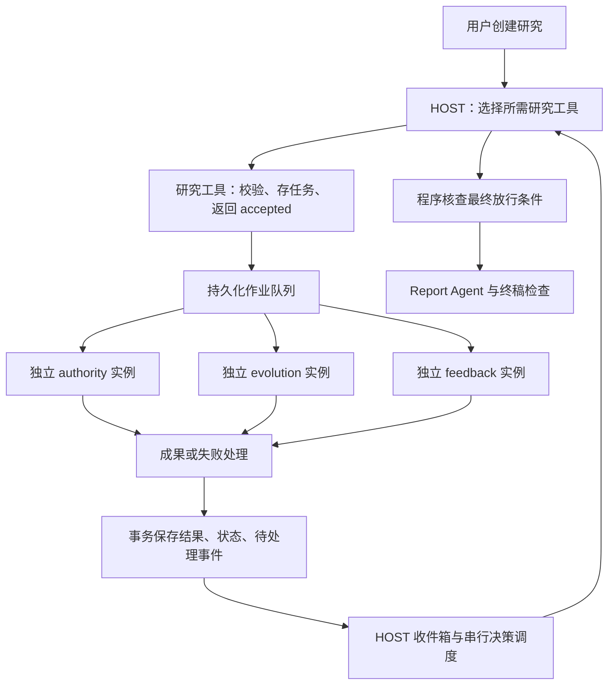

# BettaFish 子 Agent 工具化与独立执行方案

日期：2026-10-02  
现状核查基线：`dd46551`，工作区在编写前无未提交改动。  
状态：设计方案，待实现；本文不表示运行链路已接通或测试已通过。

## 1. 决策与范围

采用 HOST 主 Agent 将研究子 Agent 当作工具调用的模式。每次调用创建一个独立研究任务，立即返回回执；子 Agent 在后台执行，分别提交结果。一个任务成功、失败、超时或取消，不自动改变其他独立任务的状态，也不要求重新运行已经成功的任务。

保留 TypeScript / Node.js 单应用与现有 Pi Agent 执行层。Pi 负责模型与工具循环，业务程序负责后台任务、结果通知、预算、超时、取消、恢复和报告放行。标准链路不依赖 Python。

固定研究角色仍为权威口径 `authority`、舆情演化 `evolution`、公众反馈 `feedback`。Report Agent 继续承担综合研判与报告写作，核验组件继续检查结论与证据。

本方案替代 2026-10-01 原设计中的“每轮全部提交后才进入 HOST 评审”作为唯一触发方式；原方案的角色边界、证据原则与报告质量要求保留。本文只修改设计文档，不实施运行代码。

### 1.1 隔离的含义

隔离包括独立上下文、工具白名单、任务状态、执行实例、截止时间、取消信号、任务预算和不可覆盖的结果版本。没有被调用的研究工具不创建子 Agent，也不产生等待条件。

同一运行的数据库、总预算和报告仍是共享业务资源。一个子任务的结果可能影响最终研究判断，但不能通过共享可变上下文或异常传播破坏其他任务。用户取消整个研究、数据库不可用、全局预算不足等全局事件由程序统一处理。

首版是逻辑隔离，不是进程或操作系统沙箱隔离。同一 Node 进程崩溃会影响所有在执行的任务，需要依靠持久化恢复；CPU 密集任务另用受限工作线程或队列。

## 2. 当前实现与缺口

以下结论来自当前源码，未执行真实模型端到端验证：

| 位置 | 当前行为 | 本方案需要补齐或调整 |
|---|---|---|
| `src/agents/host.ts` | 接收委派工具，通过 Pi 运行 | 注册独立研究工具，连接 HOST 结果收件箱 |
| `src/agents/researcher.ts` | 为研究者设置提示词、工具和提交工具 | 每个任务/尝试创建独立实例，落实工具与写入范围 |
| `src/tools/delegate-research.ts` | 批量任务交给注入的回调，返回句柄 | 主入口改为单任务研究工具；批量兼容入口拆成独立作业 |
| `src/tools/submit-findings.ts` | 成果交给注入的提交回调 | 回调绑定任务、尝试和执行版本，禁止自行指定他人身份 |
| `src/orchestration/scheduler.ts` | 并发执行，整体等待 `Promise.all` | 逐个持久化成功/异常；提交完成通知；控制任务超时 |
| `src/orchestration/coordinator.ts` | `createRun` 默认创建三方任务；汇合检查要求本轮任务都有提交 | 创建 Run 时不再自动重复派三项任务；由 HOST 的工具调用派发；汇合检查不再是唯一唤醒条件 |
| `src/orchestration/review.ts` | 以全局轮次审议、定向补查与放行 | 支持独立任务结果的阶段审查，最终放行仍保留门槛 |
| `src/storage/event-store.ts` | 事件写入 SQLite | 增加可靠事件消费者、消费游标和 HOST 唤醒状态 |
| `src/runtime/budget-gate.ts` | 原子预算预留与结算；活动预留键可能回退到工具名 | 强制使用唯一调用 ID，核查并实现任务额度与总额度双重限制 |
| `src/runtime/pi-adapter.ts` | 直接包装 Pi 工具调用，调用 `agent.prompt` | 将 Pi 原生工具调用 ID 传入业务层；HOST 调用串行化 |
| `src/server.ts` | 注册研究 API 和 Python 兼容执行入口；默认内存数据库 | 组装真实模型、后台作业与 HOST 收件箱；标准入口配置文件数据库 |

目前生产源码没有自动调用 `checkRoundSyncBarrier` 并继续调用 HOST 的完整闭环。已有测试分别演示派发、提交和会商组件，不能作为真实自动通信已完成的证明。

另外，当前锁定 Pi 核心库的本地 `dist/agent-loop.js` 中，同一条模型消息的并行工具调用经过 `Promise.all` 汇总，才继续后续模型循环。因此，仅把三个长任务改成三个同步研究工具，仍可能让主 Agent 等待最慢者。业务层必须让研究工具快速返回持久化任务回执。

## 3. 方案比较与 ADR

### ADR-01：采用异步研究工具

| 备选 | 优点 | 局限 | 决定 |
|---|---|---|---|
| 同步子 Agent 工具，调用返回最终结果 | 最直观，工具调用与结果天然对应 | 一个工具批次仍等待全部返回，不利于处理中途失败 | 不作为主链路 |
| 异步子 Agent 工具，返回任务回执，结果独立通知 HOST | 结果互不阻塞，可及时补查，复用 Pi 与 SQLite | 需要可靠作业队列、结果收件箱和恢复机制 | 采用 |
| 接入 Temporal 等持久工作流平台 | 内建持久执行、超时和恢复能力 | 增加部署与框架迁移成本 | 有跨进程或长任务需求时再评估 |

异步工具仍然代表子 Agent 能力，但本次原生工具调用只负责“提交研究作业”。后续完成结果通过 HOST 收件箱进入新的模型输入，不能伪造为已经结束的原工具调用的第二份 tool result。

### ADR-02：独立任务与串行 HOST 决策

研究任务可以并发执行；同一个 Run 同时最多一个 HOST 模型调用或决策提交。新结果先入队，HOST 当前执行结束后再处理。这样可避免多个阶段评审同时补查、重复派发或覆盖计划。

### ADR-03：任务执行与最终放行分离

子 Agent 失败不取消其他任务；失败是否阻止报告发布，按该研究问题是否必要、是否有替代证据、是否允许明确标注缺口判定。不能把“任务有终态”当作“证据充分”。

## 4. 架构与数据流



图中三位研究者表示可选能力，并非每次创建 Run 都强制启动三位。标准三方专报通常调用全部三种工具；简单研究可以只调用必要角色。未使用角色明确标记 `not_applicable`。

### 4.1 一次研究的完整过程

1. API 创建 Run，保存主题、范围、交付要求和总预算；持久化初始 HOST 输入。
2. HOST 调用所需的 `research_authority`、`research_evolution`、`research_feedback` 工具。每次调用只产生一个任务。
3. 程序校验参数、工具权限、预算、依赖与调用去重；在事务中保存任务和排队事件，返回 `accepted`。
4. 后台 worker 按并发限制取任务，创建独立 ResearcherAgent，通过配置好的真实模型和本地工具研究。
5. 子 Agent 用 `submit_findings` 提交结构化成果；异常、超时、取消则由 worker 保存对应终态，不要求模型自己报告执行故障。
6. 成果或失败状态与待处理事件在一个事务中提交。HOST 收件箱消费事件，按触发规则构造新输入。
7. HOST 审查已到达成果，必要时只补查相关问题。其他独立任务继续执行。
8. 达到报告条件后形成可追溯放行记录，交给 Report Agent。未完成的非必要任务需要显式取消或转为不阻塞任务，避免修改已放行的材料快照。

## 5. 工具与结果契约

### 5.1 HOST 可用工具

| 工具 | 用途 |
|---|---|
| `research_authority` | 创建权威口径研究作业 |
| `research_evolution` | 创建传播演化研究作业 |
| `research_feedback` | 创建公众反馈研究作业 |
| `get_research_result` | 按句柄读取已完成的详细成果，不用于反复等待轮询 |
| `cancel_research_task` | 取消一个任务，不影响其他任务 |
| `request_report_release` | 提交最终放行判断，由程序核查 |

不再要求 HOST 调用一个包办三位研究者的工具后等待整批研究结束。旧 `delegate_research` 若保留，只作为迁移兼容包装，内部逐项创建独立作业，返回各自回执。

输入示例：

```json
{
  "question": "核对地铁恢复运营通告和退票安排的正式原文",
  "scope": { "region": "示例城市", "time_window": "最近48小时" },
  "completion_criteria": "提供通告正文来源，并列出已明确和未明确的退票事项",
  "requested_budget_units": 12,
  "required_for_report": true
}
```

`run_id`、HOST 调用 ID、Pi 原生 `tool_call_id`、用户权限和执行版本由程序绑定。模型提出预算请求，但程序按任务额度、全局剩余额度和写作预留裁定。截止时间使用服务配置，模型不能取消上限。

即时回执示例：

```json
{
  "status": "accepted",
  "task_id": "task-authority-example",
  "attempt_id": "attempt-1",
  "role": "authority",
  "result_pending": true
}
```

`accepted` 只表示作业已可靠入队。与后续 `succeeded` 必须严格区分。入队校验失败则返回结构化 `rejected`，不能假装任务已开始。

### 5.2 独立完成结果

```ts
type ResearchOutcome = {
  run_id: string;
  task_id: string;
  attempt_id: string;
  execution_version: number;
  role: 'authority' | 'evolution' | 'feedback';
  status: 'succeeded' | 'partial' | 'failed' | 'timed_out' | 'cancelled';
  result_ref?: string;
  summary?: string;
  error?: { code: string; message: string; retryable: boolean };
  usage: { tool_attempts: number; model_tokens?: number };
  completed_at: string;
};
```

完整成果沿用现有 `claims`、`evidence_pool` 和角色 finding 契约，经校验后保存为不可覆盖的版本。HOST 输入默认传摘要、关键证据引用和局限，按需读取细节，避免每次复制所有原始网页。

`partial` 表示收到有效成果但覆盖不足；数据来源确实不可得要记录覆盖限制。网络异常或数据库故障是执行失败，不能描述成“检索证明不存在”。

`submit_findings` 绑定当前任务身份。模型传入的 role、round 等字段需要核对，不允许写入其他任务或其他 Run。证据 ID 保存后必须保持一致或显式映射，所有主张引用都要解析到有效证据。

## 6. HOST 何时被调用，结果怎样进入 prompt

HOST 不是常驻空转的大模型。程序收到重要变化时，对一个明确的材料快照发起一次模型调用；已有 HOST 正在运行就先入队。

| 事件 | 处理规则 |
|---|---|
| 独立任务成功或部分完成 | 默认安排阶段审查；短时间多个结果合并成一次调用 |
| 不可恢复失败或重试耗尽 | 及时通知 HOST，带上错误类别和可用材料 |
| 任务截止时间到达 | 程序先记录超时、取消该尝试，再让 HOST 决定后续 |
| 子 Agent 提出需要协调的问题 | 通过单独 `request_host_help` 接口提交，明确问题，限制频率；不共享内部思考或任意修改同伴任务 |
| 普通检索进度、短暂错误正在自动重试 | 保存并向 UI 展示，不必调用 HOST |
| 最终放行条件可能满足 | 调用 HOST 综合评审；程序验证放行要求 |

建议初始配置：完成事件合并窗口 500ms；每个 Run 同时一个 HOST 调用；阶段决策调用总上限 12 次，另有模型费用上限。以上为待测配置，不是当前性能或成本结论。失败和超时仍会入队，即使 HOST 额度不足，也由程序进入明确的暂停/受限状态，不能无限等待。

新输入包含：

```text
本次变化：公众反馈任务已完成；演化任务失败；权威任务仍在执行。
当前计划：各任务的 ID、状态、范围、完成标准和是否为报告必需。
新成果：公众反馈摘要、关键主张和证据编号、样本限制。
执行问题：演化来源不可访问，自动重试已耗尽。
可用额度：任务与全局余额、剩余研究修订次数。
请决定：接受成果、读取详情、对指定问题补查、继续等待或申请报告放行。
```

HOST 的固定 system prompt 保持职责与约束；材料以数据区块进入新的输入，不混入系统指令。外部文本和子 Agent 成果不能改变工具权限。队列中每个事件 ID、材料版本和决策快照都可追溯。

程序在 HOST 空闲时才调用 `host.run(prompt)`，不会同时向同一 Pi 实例发起多个 `prompt`。同一任务结果只对应一个完成通知；完成通知进入新的输入，不冒充原派发工具的延迟返回。HOST 在回执之后选择等待时结束本次调用，由收件箱安排下一次调用，禁止循环调用查询工具空等。

## 7. 隔离、失败和资源约束

### 7.1 上下文与工具

- 每个任务/尝试创建自己的 Pi Agent、消息历史、BudgetGate、AbortController 和工作目录。
- 子 Agent 只获得任务目标、选定背景与证据引用，不获得 HOST 的全部对话或同伴的可变上下文。
- 角色工具按最小能力注册。例如权威口径使用搜索、原文读取和成果提交；公众反馈使用评论、情感分析及成果提交。具体白名单根据已配置数据源确定。
- 默认不允许子 Agent 委派其他子 Agent，控制递归和成本。
- 共享工具函数可以复用，但带状态的客户端、预留映射和写入权限必须按任务绑定。
- 需要参考同伴证据时，只读取 HOST 明确传入的、已经接受的不可变快照，记录显式依赖；其余任务独立运行。

### 7.2 执行与取消

每个 worker 捕获该任务异常，分别保存 `failed` 等结果；不能让单个 reject 直接中断整批结果处理。可用 `Promise.allSettled` 回收 worker，但 HOST 的通知必须发生在每个任务终态提交后，而不是等 allSettled 返回后统一通知。

工具调用返回 `accepted` 后，其后台作业不继承这次短工具调用的生命周期；后台作业由 Run 与任务级控制器管理。取消某任务只触发自己的控制器，取消 Run 才触发全部任务控制器。

超时必须向模型与网络调用传递取消信号，不能只用 `Promise.race` 返回后让旧调用继续写入。无法立即中止的外部调用仍可能产生费用，记录实际用量；迟到响应被版本检查拒绝。模型、单工具、单任务和整个 Run 分别有配置期限。

### 7.3 重试与预算

- 可重试网络错误使用有界退避；默认建议最多两次自动重试，仍受总期限和预算限制。无权限、参数错误和来源确实不可得不能盲目重试。
- 重试只针对失败任务或调用，不重跑其他已成功任务。
- 每次实际外部执行尝试都计费；创建后台作业的控制调用与研究中的付费动作分别记账，避免重复扣费。
- 同一 task 与总 Run 额度在事务中同时检查，保留报告写作额度。一个任务不能耗尽其他任务已分配的保底额度。
- 预算预留使用唯一 `call_id`，不以工具名作为键；结算按执行记录完成一次。预留中的调用在崩溃恢复时需核对实际状态，不能无条件退款或重复执行。
- 补查创建新任务版本，保留已有成果；修改某个角色任务不会使其他角色执行失效。Run 级 `execution_version` 仅用于暂停恢复、整体取消等全局切换，不能每次局部补查都递增。

研究修订上限仍保留三代：初始问题 generation=1，针对同一问题的实质补查最多 generation=3；技术重试使用 attempt 计数，不算实质补查。阶段通知次数不再等于全局研究轮次。既有 `current_round` 和第3轮收敛逻辑需要迁移为明确的任务修订约束，不能简单删除限制；即使达到上限，关键证据缺失也只能暂停或明确受限交付，不能强行宣称材料齐全。

### 7.4 状态范围

建议任务执行状态：`queued → running → succeeded | partial | failed | timed_out | cancelled`。HOST 对材料的 `accepted / needs_followup / unusable` 是单独评审状态，执行成功不代表材料质量已被接受。

暂停 Run 时，暂停 HOST 派发与消费，将正在执行的任务按策略取消并保存检查点；已完成结果保留。恢复仅重建未结束任务的尝试，不重跑已接受成果。Run 状态必须由明确规则推导，不能每收到一个结果就把整次运行在 `researching` 与 `reviewing` 间来回覆盖。

## 8. 持久化与恢复

在现有 SQLite 上增加字段/表，具体迁移编号由实施时决定：

| 对象 | 必需信息 |
|---|---|
| tasks | 工具调用关联、问题 generation、完成标准、必需标记、依赖、截止时间、任务额度、是否被新任务替代 |
| task_attempts | attempt_id、执行版本、状态、worker 租约、开始/结束时间、错误和用量 |
| task_results | 不可变成果版本、attempt、证据引用、有效性与 HOST 接受状态 |
| event_outbox | 事件 ID、类型、任务、结果版本、投递状态与重试信息 |
| host_inbox / host_decisions | 已消费事件、材料快照、HOST 调用状态、决策、唯一请求键 |

成果、任务终态与 outbox 事件必须同事务提交，避免“保存了成果但没通知”或“先通知却读不到成果”。消费允许至少一次投递，按事件 ID 去重；不声称外部模型或工具能做到物理上严格只调用一次。

去重键至少包括 `run_id + execution_version + host_turn_id + tool_call_id`；同一次 HOST 工具调用被重复投递时返回原回执。HOST 基于同一材料快照的重复决策不得重复创建同一补查任务。语义相近的问题是否重复仍由计划检查与 HOST 审查，不仅依靠文本相等。

首版一个 Node 应用负责后台 worker 与 HOST 消费器，SQLite 使用文件路径；默认 `:memory:` 仅用于测试。重启先恢复未投递事件，过期 worker 租约转为 interrupted/待处理尝试，并按暂停或重试策略处理。HOST 上下文由持久化的任务目标、已接受决策和材料快照重建，不能依赖内存中的 Pi 实例存活。

共享数据库无法写入属于全局基础设施故障：停止新的派发与放行，报告明确状态。它不属于可以靠“子 Agent 互相隔离”解决的单任务异常。

## 9. 最终报告放行

最终放行检查研究问题和必要任务，不检查固定三个工具是否全部成功：

1. 必要问题有已接受成果，或有符合交付政策的明确缺口处理记录。
2. 未调用角色有不适用说明，不伪造角色成果。
3. 没有尚在执行的报告必要任务或未处理的重要完成事件。
4. 核心主张引用可解析证据，关键材料已核验，样本与范围局限明确。
5. HOST 申请放行时绑定材料版本快照；程序确认没有新的必要结果或计划变化使判断过期。
6. 记录 HOST 判断、程序门禁结果、未解决事项与是否为受限交付。

例如 evolution 失败而另两项成功：另两项成果照常审查与保留；若报告要求量化热度曲线，应补查或暂停；若用户允许只研究官方回应和评论诉求，可形成标明“传播趋势数据缺失”的受限报告。不能据失败推断事件热度下降。

Report Agent 沿用既有综合判断、证据引用、IR 校验和导出职责。它基于放行快照工作，不能暗中恢复已经失败的研究或修改原始证据。

## 10. 实施顺序与文件落点

| 顺序 | 工作 | 主要落点 | 完成条件 |
|---|---|---|---|
| 1 | 明确单任务工具、作业回执、完成结果与评审契约 | `contracts/task.ts`，新增研究作业/事件契约 | 参数与结果校验明确，接受回执不冒充研究成功 |
| 2 | 保存尝试、结果、outbox、HOST 收件箱及租约 | `storage/migrations/`、repositories、event-store | 原子提交、去重与重启恢复可验证 |
| 3 | 创建独立研究工具与真实 worker | `tools/`、`agents/researcher.ts`、`orchestration/scheduler.ts` | 一个失败不影响另一个；完成事件逐个到达 |
| 4 | 双层预算、任务取消和实际调用 ID | `budget-gate.ts`、`pi-adapter.ts`、call-ledger | 同名并发调用各自结算；单任务额度有效 |
| 5 | HOST 串行通知与任务阶段审查 | 新增 `orchestration/host-inbox.ts`、调整 host 与 review | 一个结果先到即能被处理，不等待最慢者 |
| 6 | 问题修订上限、材料快照和报告门禁 | planning、review、reporting/input | 必要问题未完成不能误放行；成功成果可沿用 |
| 7 | 组装应用入口与 API/UI 状态 | `server.ts`、routes、dashboard、SSE | 创建 Run 后能自动研究、通知、补查与报告 |
| 8 | 独立失败、恢复与真实模型小规模验收 | `tests/`、运行指南 | 下节场景通过；真实模型与脚本测试分开报告 |

复用现有 Pi SDK 与角色提示词，不创建第二套模型循环，不重建 Python/TS 双核心。实施时旧测试按新语义更新，保留证据、导出、预算和取消的回归检查。

## 11. 验收场景

1. 同时启动三任务，一个立即成功、一个慢、一个失败；成功先保存并通知 HOST，慢任务继续执行，失败不取消同伴。
2. 只调用公众反馈工具，不创建其他角色任务，不等待未调用角色。
3. 同一角色两个独立任务并发，上下文、取消和预算预留互不覆盖。
4. 单任务超时后不可继续写入；其他任务正常结束；迟到结果不能覆盖新尝试。
5. 取消一个任务不影响同伴；取消整个 Run 阻止所有新派发与放行。
6. 重复工具调用回执、完成事件或 HOST 决策，不造成重复任务、重复写入或重复预算结算。
7. 两个完成事件同时到达，同一 Run 不同时运行两个 HOST 决策；通知可合并但不能丢失。
8. HOST 忙时新成果入队，空闲后会处理；没有定时大模型空转或无限状态查询。
9. 保存成果后、投递通知前崩溃，重启仍能投递；已消费事件不会重复造成补查。
10. 文件数据库下恢复任务；不依赖内存 Pi 对话或测试用内存数据库。
11. 子任务额度、总额度和报告预留都生效；重试计入实际消耗；同名工具并发分别结算。
12. 必需角色失败、可选角色失败、角色不适用分别得到暂停、受限交付或正常交付，不混淆执行完成与材料充分。
13. 阶段评审不消耗实质补查代数；同一问题第三代后不能无限补查，也不能绕过关键证据缺口。
14. 放行后的材料快照保持稳定，迟到或新版本结果只能发起明确新修订，不能静默改变正在写的报告。

脚本化模型用于验证通信和状态；真实模型小样本用于核查工具选择、成果质量、成本与延迟。不得用脚本测试证明真实模型研究效果。

## 12. 参考与取舍

- 本地 Pi 版本以 `agent-runtime/package.json` 锁定的 `@earendil-works/pi-agent-core@0.99.2` 为准；执行批次等待行为核查了本地安装源码。实施前需重新确认锁文件和 SDK 接口。
- [LangGraph 官方工作流与 Agent 模式](https://docs.langchain.com/oss/javascript/langgraph/workflows-agents)：参考编排者、独立 worker 和成果汇总的职责划分；不据此假定其每个 worker 完成就触发模型。
- [Temporal TypeScript 消息机制](https://docs.temporal.io/develop/typescript/workflows/message-passing)：参考异步通知、等待条件与并发处理约束。
- [Temporal TypeScript Activity 超时](https://docs.temporal.io/develop/typescript/activities/timeouts)：参考任务与调用期限设计。本方案不直接引入 Temporal。

异步工具增加持久化与恢复复杂度，换来独立完成、局部重试和及时协调；阶段通知会增加模型调用，需要事件合并、调用上限和费用限制。共享总预算、存储与最终报告意味着隔离不是完全无关联，而是明确限制单任务失败的传播范围。
